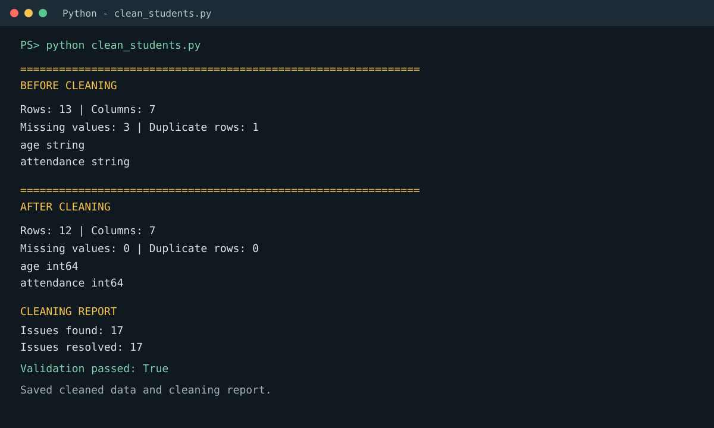

# Day 10: Student Data Cleaning with Pandas

A reusable Pandas pipeline that prepares intentionally messy student records for analysis.

## What It Demonstrates

- Detecting and reporting missing values
- Finding and removing duplicate records
- Converting malformed age and attendance values to numeric types
- Standardizing names, genders, and grades
- Validating quality before and after cleaning
- Exporting a cleaned CSV and a JSON cleaning report

## Project Files

| File | Purpose |
| --- | --- |
| `students_raw.csv` | Source dataset with intentional data quality issues |
| `clean_students.py` | Reusable load, inspect, clean, validate, and report functions |
| `students_cleaned.csv` | Generated output after running the pipeline |
| `cleaning_report.json` | Generated issue counts, validation results, and operations |
| `requirements.txt` | Python dependency |

## Run

```bash
python -m pip install -r requirements.txt
python clean_students.py
```

The script prints before-and-after summaries, issue counts, data types, and validation status. It also creates `students_cleaned.csv` and `cleaning_report.json` in the project directory.

## Expected Result

- Raw records: 13
- Clean records: 12
- Missing values found and resolved: 3
- Duplicate rows found and removed: 1
- Malformed age entries converted: 2
- Validation: passed

## Output Screenshot

The run below documents the before-and-after checks, issue counts, and successful validation:



The screenshot is stored in the repository so the project documentation remains complete when viewed on GitHub.

## Learning Resources

- [Pandas Missing Data](https://pandas.pydata.org/docs/user_guide/missing_data.html)
- [Pandas Data Cleaning](https://pandas.pydata.org/docs/getting_started/intro_tutorials/06_calculate_statistics.html)
- [Pandas Data Types](https://pandas.pydata.org/docs/user_guide/basics.html#dtypes)
- [Pandas Duplicate Data](https://pandas.pydata.org/docs/reference/api/pandas.DataFrame.drop_duplicates.html)
