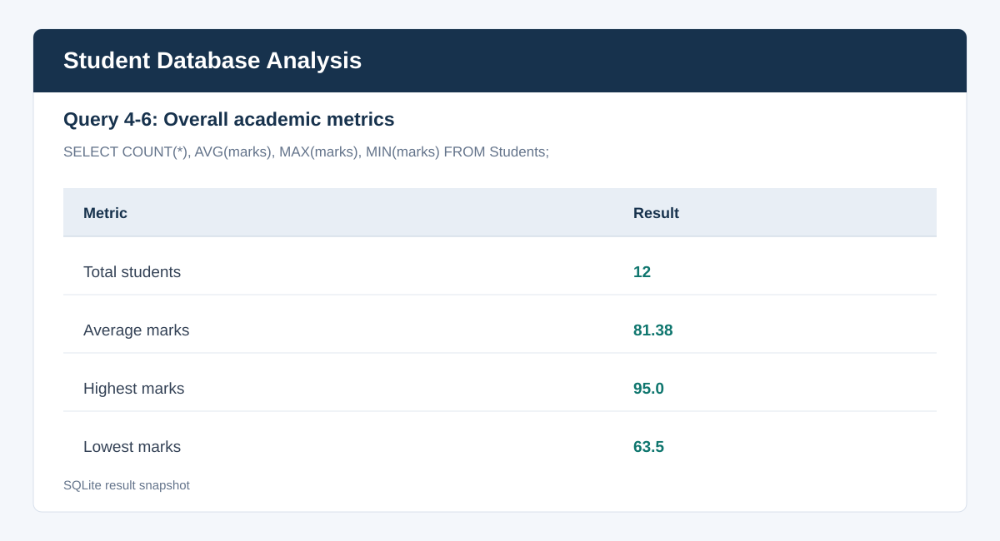
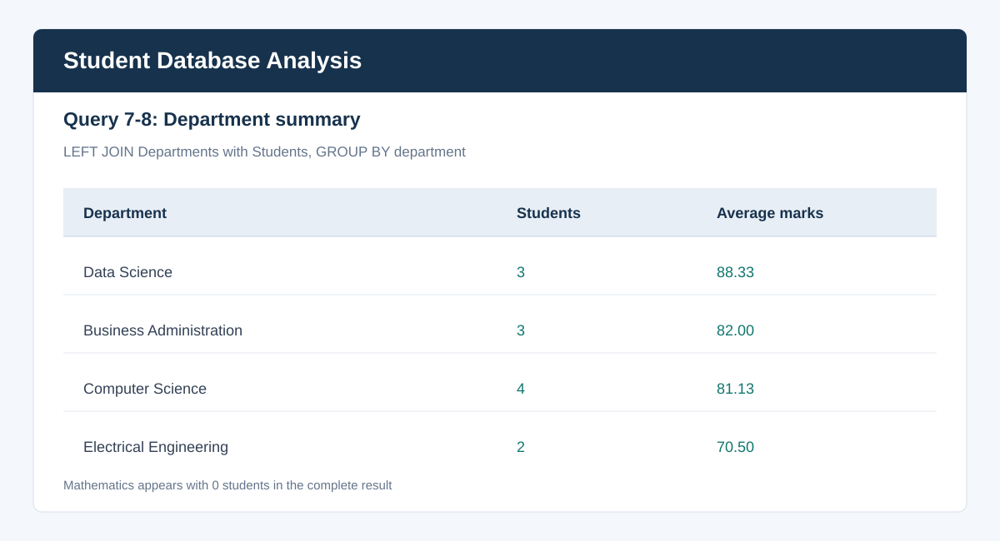
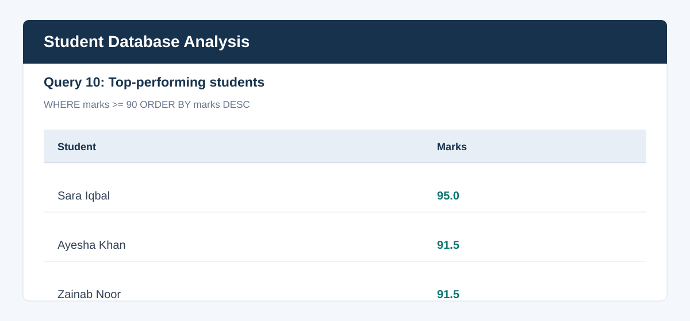

# Student Database Analysis System

Day 11 SQL Fundamentals & Database Analysis task. This project creates a small relational database for student, department, and course records, then uses SQL to answer common academic and business questions.

## Files

- `student_database.sql`: schema, sample data, and all required analysis queries.
- `README.md`: project documentation and query-output screenshots.
- `screenshots/`: query result screenshots generated from the included sample data.

## Database Design

```text
Departments (department_id PK, department_name, building)
    |
    +-- Students (student_id PK, student_name, department_id FK, semester, age, marks)
    |
    +-- Courses (course_id PK, course_code, course_name, department_id FK, credit_hours)
```

The script uses SQLite-compatible SQL and enables foreign-key enforcement. It can be run repeatedly because it recreates the tables before inserting the sample data.

## Covered SQL Concepts

The query section includes `SELECT`, `WHERE`, `ORDER BY`, `COUNT`, `AVG`, `MAX`, `MIN`, `GROUP BY`, `HAVING`, `INNER JOIN`, `LEFT JOIN`, subqueries, `ROW_NUMBER()`, `RANK()`, and a common table expression (CTE).

## Run The Project

Using Python, which includes SQLite support:

```powershell
python -c "import sqlite3; connection=sqlite3.connect('student_analysis.db'); connection.executescript(open('student_database.sql').read()); print('Database created and queries loaded successfully'); connection.close()"
```

To inspect a specific query, open `student_database.sql` and run the selected statement in any SQLite-compatible database client.

## Result Snapshots

These screenshots are based on the included sample data and provide query-output evidence for the submission.

### Overall metrics

| Metric | Result |
| --- | ---: |
| Total students | 12 |
| Average marks | 81.38 |
| Highest marks | 95.0 |
| Lowest marks | 63.5 |

### Department summary

| Department | Students | Average marks |
| --- | ---: | ---: |
| Data Science | 3 | 88.33 |
| Computer Science | 4 | 81.13 |
| Business Administration | 3 | 82.00 |
| Electrical Engineering | 2 | 70.50 |
| Mathematics | 0 | NULL |

### Top-performing students

| Student | Marks |
| --- | ---: |
| Sara Iqbal | 95.0 |
| Ayesha Khan | 91.5 |
| Zainab Noor | 91.5 |

### Query Output Screenshots

#### Overall metrics



#### Department summary



#### Top-performing students



The SQL comments label every required query so each screenshot can be matched to its purpose.

## Submission Checklist

- [x] Tables created: `Students`, `Departments`, and `Courses`.
- [x] Tables populated with sample data.
- [x] Required retrieval, filtering, sorting, aggregation, join, and ranking queries included.
- [x] Advanced SQL concepts demonstrated with comments.
- [x] README includes project details and query-output screenshots.
- [ ] Commit and push to GitHub from the local repository.