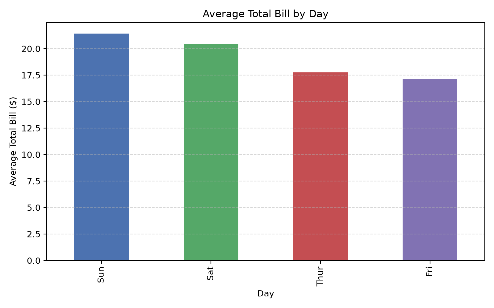
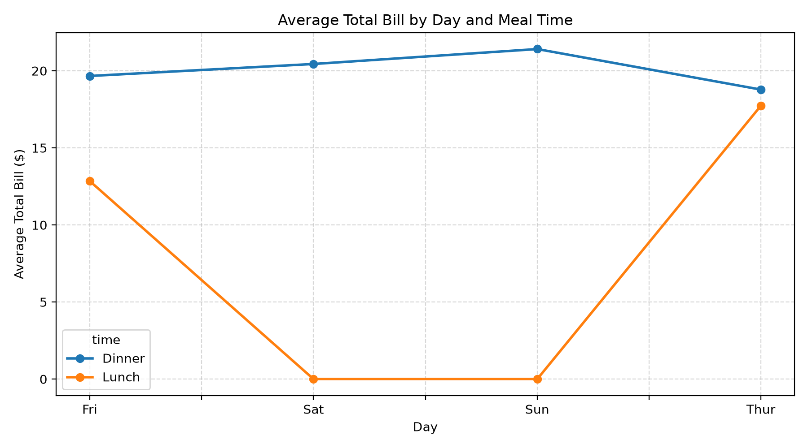
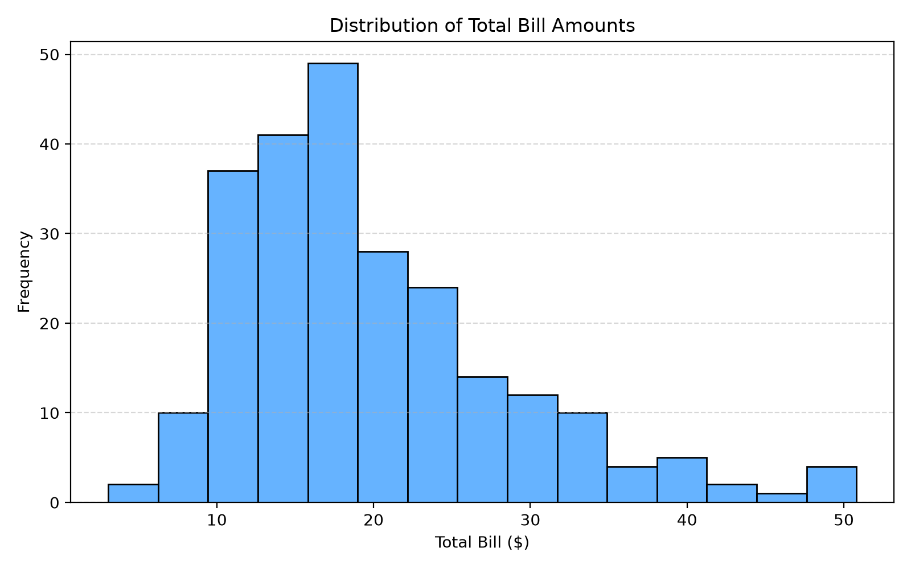

# Exploratory Data Analysis (EDA) Project

## Project Overview
This project performs a complete Exploratory Data Analysis on a public restaurant tipping dataset. The analysis includes data loading, cleaning, summary statistics, trend analysis, and visualization to generate actionable insights from real-world dining behavior.

## Dataset
- Source: Seaborn public dataset (restaurant tips dataset)
- Records: 244 rows
- Features: total bill, tip, sex, smoker, day, time, size
- Format: CSV

## Objective
The main goal is to identify patterns in customer spending, understand how factors such as day, time, smoking status, and party size influence restaurant bills, and communicate those findings with clear visualizations.

## Project Structure
- `eda_report.py` - data loading, cleaning, analysis, and chart generation
- `data/tips.csv` - cleaned local dataset copy
- `outputs/` - generated visualization images
- `README.md` - project summary and documentation

## Technical Stack
- Python
- NumPy
- Pandas
- Matplotlib

## Data Cleaning Steps
1. Loaded the dataset from a public CSV source.
2. Standardized column names by converting them to lowercase and replacing spaces with underscores.
3. Checked for missing values and filled numeric gaps with median values.
4. Replaced missing categorical entries using the mode.
5. Removed duplicate records and reset the index.

## Summary Statistics
The dataset provides a quick overview of the distribution of total bills and tips, including measures such as mean, standard deviation, and median values. These statistics help identify typical spending patterns and outliers.

## Visualizations
The report includes the following charts:

1. Average total bill by day
2. Average total bill by day and meal time
3. Histogram of total bill distribution





## Key Findings
1. Weekends have higher average restaurant spending than weekdays.
2. Dinner has a greater average bill than lunch.
3. Larger groups spend more on average than smaller groups.
4. Smokers spend more on average than non-smokers.
5. The average tip percentage is consistent with a service-driven relationship between bill size and tip amount.

## How to Run
```bash
python eda_report.py
```

## Conclusion
The EDA shows meaningful spending patterns in restaurant behavior. The results suggest that time, day, smoking status, and party size all influence total bill amounts, which is useful for planning and understanding customer trends.
