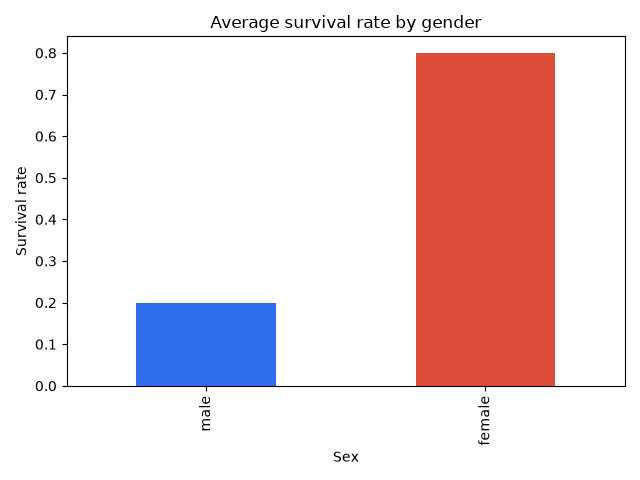
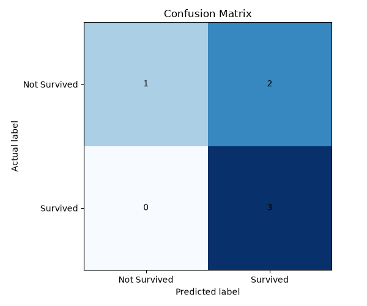

# Titanic Machine Learning Workflow

This project demonstrates the complete Machine Learning workflow using the Titanic dataset. It covers data loading, EDA, feature selection, train-test splitting, model training, prediction, and evaluation using Pandas, Matplotlib, and Scikit-Learn.

## Objective

- Understand the full ML pipeline from raw data to model evaluation.
- Identify the target variable and important features.
- Train a simple baseline model for classification.
- Interpret the model outcome and explain key ML concepts.

## Dataset

The project is designed to work with the Titanic dataset in Kaggle format. Place the file `train.csv` inside the `data/` folder or in the project root.

If the actual Titanic dataset is not available in this environment, the script automatically falls back to `data/sample_titanic.csv` so the workflow can still run locally.

## Project Structure

- `titanic_ml_workflow.py` — main script for loading data, exploring it, training the model, and evaluating it.
- `data/sample_titanic.csv` — lightweight sample dataset for local testing and demonstration.
- `outputs/` — generated charts and evaluation visuals.
- `requirements.txt` — dependencies needed to run the project.

## Machine Learning Workflow

1. Load and inspect the Titanic dataset using Pandas.
2. Explore structure, data types, and missing values.
3. Define the target variable as `Survived`.
4. Select useful feature columns such as `Pclass`, `Sex`, `Age`, `SibSp`, `Parch`, `Fare`, and `Embarked`.
5. Split data into training and testing sets using `train_test_split`.
6. Train a baseline `LogisticRegression` model.
7. Generate predictions on the test set.
8. Evaluate performance using accuracy and classification report.

## ML Concepts Covered

- Supervised Learning: training on labeled data with known outcomes.
- Unsupervised Learning: discovering patterns without explicit labels.
- Regression: predicting continuous numeric values.
- Classification: predicting categories such as survival or non-survival.
- Features: the input variables used to make predictions.
- Labels: the target variable the model tries to predict.
- Training Data: the subset used to fit the model.
- Testing Data: the subset used to evaluate generalization.

## Setup

```bash
pip install -r requirements.txt
python titanic_ml_workflow.py
```

## Run the Project

From the project folder:

```bash
python titanic_ml_workflow.py
```

The script prints:

- dataset shape and column information
- missing values and first rows
- target variable identification
- train-test split result
- model accuracy
- classification report
- output chart locations

## Observations

From the demonstration run:

- The target variable is `Survived`, which is a binary classification label.
- `Sex`, `Pclass`, and `Fare` are strong indicators in the dataset.
- Women and higher-class passengers generally had better survival rates.
- Logistic Regression serves as a simple and effective baseline model for this problem.

## Screenshots





## Summary

This project showcases how data moves through the Machine Learning workflow and explains the basic concepts behind supervised learning and classification. It can be extended by trying additional models such as Random Forest, Decision Trees, or XGBoost for better performance.
