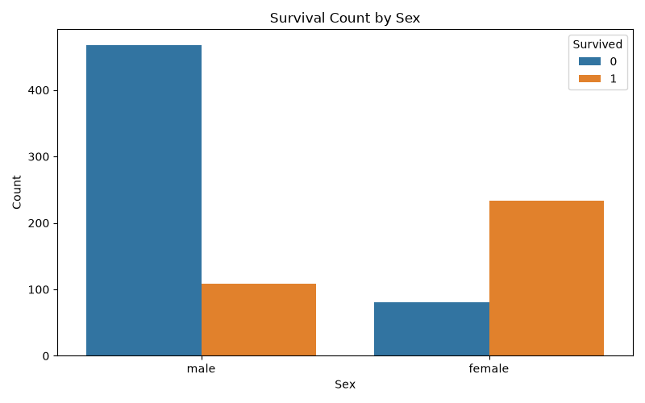
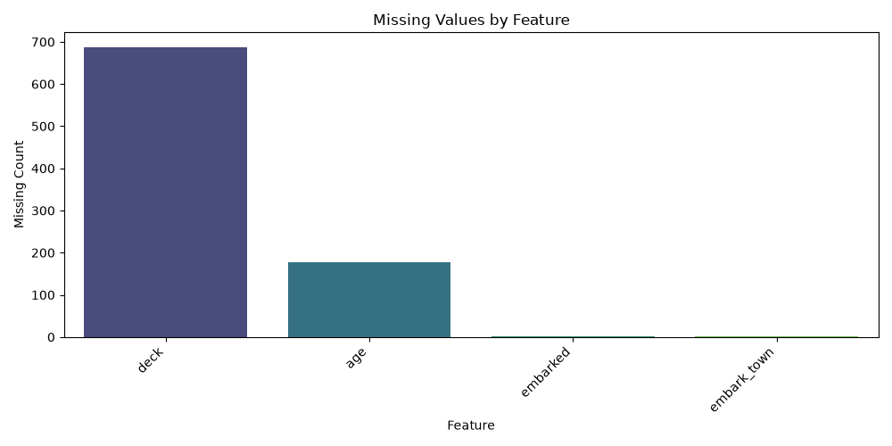

# Day 14 Task: Data Preparation Pipeline

## Objective
This project builds a professional data preparation workflow for the Titanic dataset using Pandas and Scikit-Learn. The workflow covers data inspection, handling missing values, categorical encoding, numerical scaling, and a leakage-safe train-test split.

## Dataset
The project uses the Titanic dataset from Seaborn's built-in dataset, which mirrors the public Titanic data commonly used in Kaggle competitions and tutorials.

## Workflow Summary
1. Load the dataset with Pandas.
2. Inspect data types, numerical columns, categorical columns, and missing values.
3. Split the dataset into training and testing sets before preprocessing.
4. Fit imputation and scaling/encoding steps only on the training data.
5. Transform the test data using the trained preprocessing objects.
6. Save the prepared data and a visual summary for interpretation.

## Key Observations
- The dataset includes a mixture of numeric and categorical features.
- Missing values appear in fields such as `age`, `embarked`, and `deck`/`cabin`.
- Numeric variables were scaled with `StandardScaler` to standardize feature ranges.
- Categorical variables were encoded with `OneHotEncoder` after imputation.

## Data Leakage Prevention
This project follows best practice by using the following rule:

> The train-test split happens before any scaling or encoding, and all preprocessing is fit only on the training set.

This prevents information from the test set from influencing the model-building process. The same fitted preprocessing objects are then used to transform the test set.

## How to Run
```bash
python titanic_preprocessing.py
```

If the environment has no internet access, the script will fall back to the `titanic.csv` file in the project folder when available.

## Output Files
- `outputs/missing_values_summary.csv`
- `outputs/X_train_preprocessed.csv`
- `outputs/X_test_preprocessed.csv`
- `outputs/survival_by_sex.png`
- `outputs/missing_values_distribution.png`

## Screenshots

### Survival count by sex


### Missing value distribution


## Conclusion
The Titanic dataset was successfully prepared for machine learning by cleaning missing values, transforming categorical variables, scaling numerical features, and preventing data leakage through careful train-test separation.
