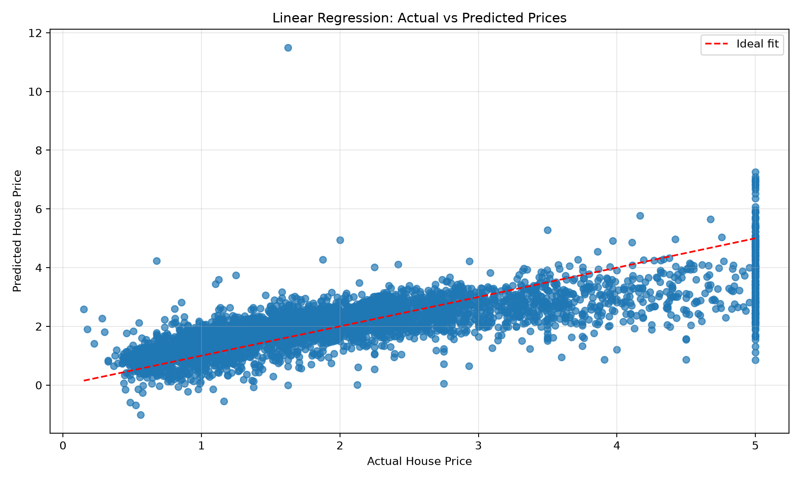

# House Price Prediction using Linear Regression

This project builds a house price prediction system using a real-world housing dataset and a linear regression model. The workflow includes data preparation, feature selection, model training, prediction generation, and performance evaluation.

## Objective
To predict house prices using relevant property features and evaluate model quality using regression metrics.

## Dataset
The project uses the California Housing dataset from scikit-learn as a reliable real-world housing dataset. If the dataset is not already available in the `data/` folder, the script downloads it and saves a local CSV copy for reuse.

## Tech Stack
- Python
- Pandas
- Matplotlib
- Scikit-Learn

## Project Structure
- `house_price_prediction.py`: main script for loading data, training the model, and evaluating results.
- `data/house_data.csv`: generated dataset used for model training.
- `results/actual_vs_predicted.png`: scatter plot comparing actual and predicted house prices.
- `requirements.txt`: required Python dependencies.

## Workflow
1. Load housing dataset using Pandas.
2. Explore the dataset and select relevant forecasting features.
3. Handle missing values and remove incomplete records.
4. Split data into training and testing sets.
5. Train a Linear Regression model.
6. Generate predictions on unseen test data.
7. Measure performance using MAE, MSE, RMSE, and R² Score.
8. Save the actual-vs-predicted visualization.

## Model Evaluation
The script prints the following metrics:
- Mean Absolute Error (MAE)
- Mean Squared Error (MSE)
- Root Mean Squared Error (RMSE)
- R² Score

## How to Run
```bash
pip install -r requirements.txt
python house_price_prediction.py
```

## Sample Results
A typical training run produces metrics similar to the following:
- MAE: around 0.50
- MSE: around 0.40
- RMSE: around 0.63
- R²: around 0.60

Exact values can vary slightly depending on the dataset split and environment.

## Output Screenshot


## Observations
The linear regression model provides a solid baseline for house price prediction. It is simple, fast, and easy to interpret, but it may not capture more complex non-linear relationships in real estate pricing.

## Output
The script saves the comparison plot in the `results/` folder, allowing users to visually inspect the model's predictive performance.
