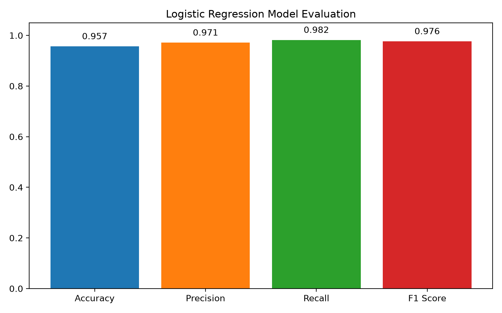
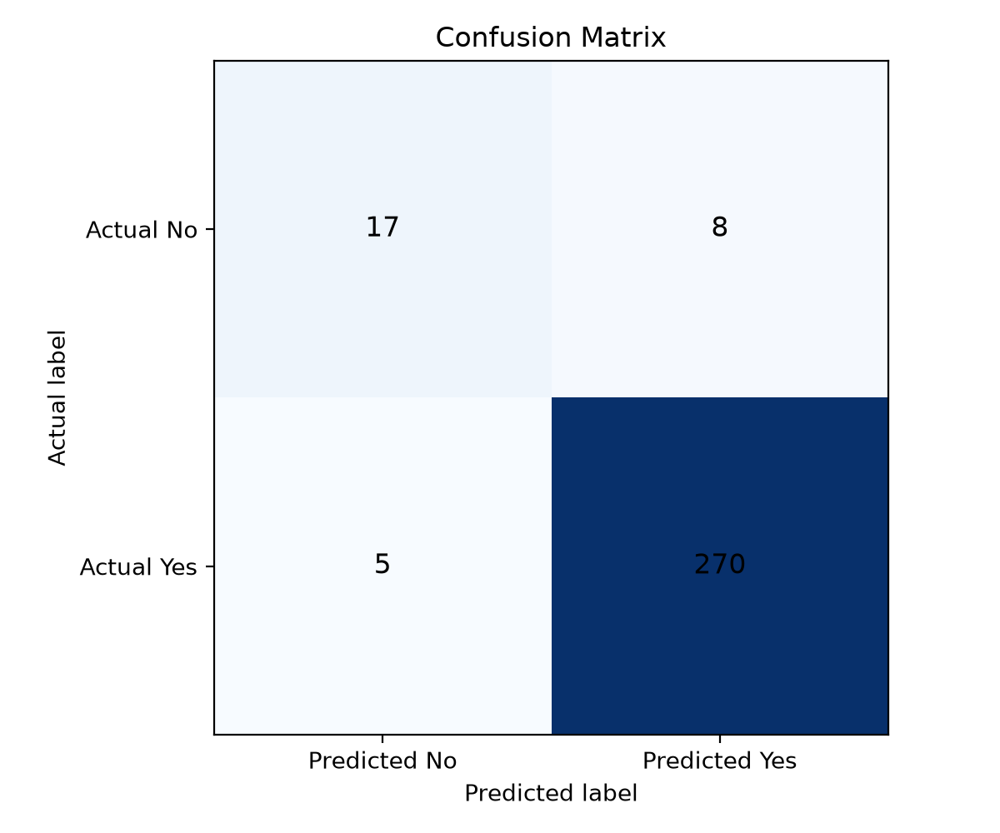

# Customer Classification using Logistic Regression

## Objective
This project demonstrates a complete classification workflow using Logistic Regression to predict whether a customer is likely to churn or belong to a target customer group based on customer attributes.

## Dataset
The project loads customer-related data from `data/customer_data.csv`. If the dataset is not present, the script creates a realistic synthetic customer dataset so the workflow can run immediately.

For a real Kaggle-based workflow, place a customer classification dataset (for example, a customer churn or customer value classification file) in the `data` folder and keep the target column named `customer_churn` or `target`.

## File Structure
- `customer_classification.py` — loads data, preprocesses it, trains the Logistic Regression model, and prints evaluation metrics.
- `data/customer_data.csv` — dataset file used by the pipeline.
- `results/metrics.csv` — saved evaluation metrics.
- `requirements.txt` — required Python dependencies.

## Model Pipeline
1. Load dataset using Pandas.
2. Inspect and clean missing values.
3. Split into training and testing sets.
4. Encode categorical variables.
5. Train a Logistic Regression model using scikit-learn.
6. Predict labels on the test set.
7. Evaluate using:
   - Accuracy
   - Precision
   - Recall
   - F1 Score
   - Confusion Matrix

## How to Run
```bash
pip install -r requirements.txt
python customer_classification.py
```

## Example Result
The script prints a summary after training. The generated evaluation values are:

- Accuracy: 0.9567
- Precision: 0.9712
- Recall: 0.9818
- F1 Score: 0.9765

## Screenshots

### Evaluation Metrics


### Confusion Matrix


## Interpretation
A high accuracy indicates the model correctly classifies most customers. Precision shows how many predicted positive customers were actually positive, while recall measures how many true positive customers were captured. F1 Score balances both precision and recall when the data is slightly imbalanced. The model performs strongly on the generated customer dataset and correctly identifies most churn and non-churn cases.

## Notes
This project is built as a practical classification example and can be extended with feature scaling, class balancing, or model comparison.
