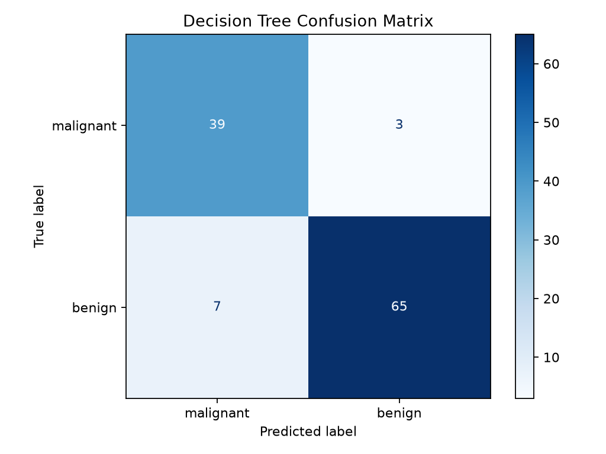
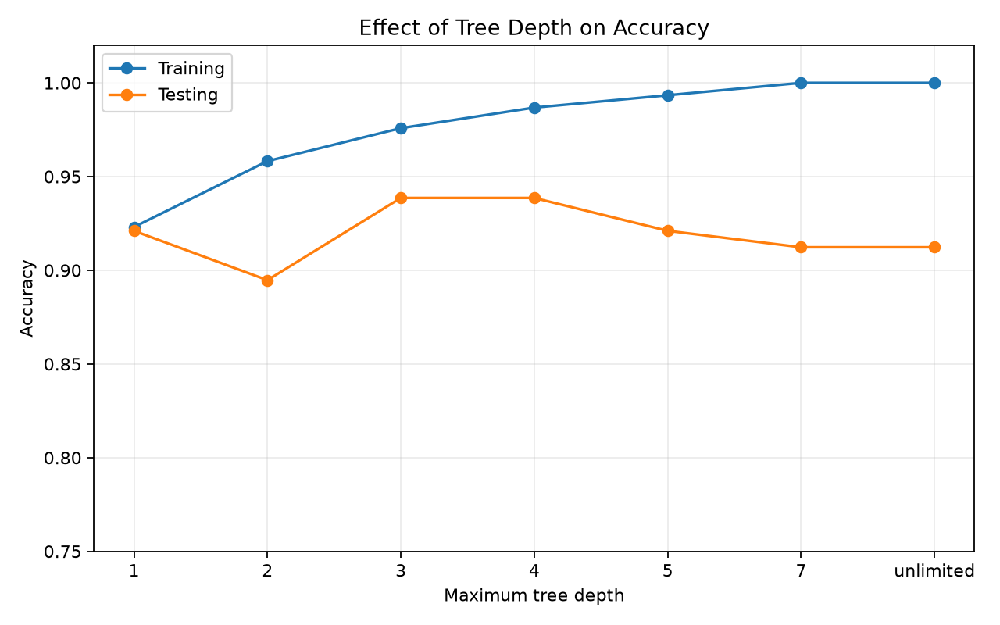
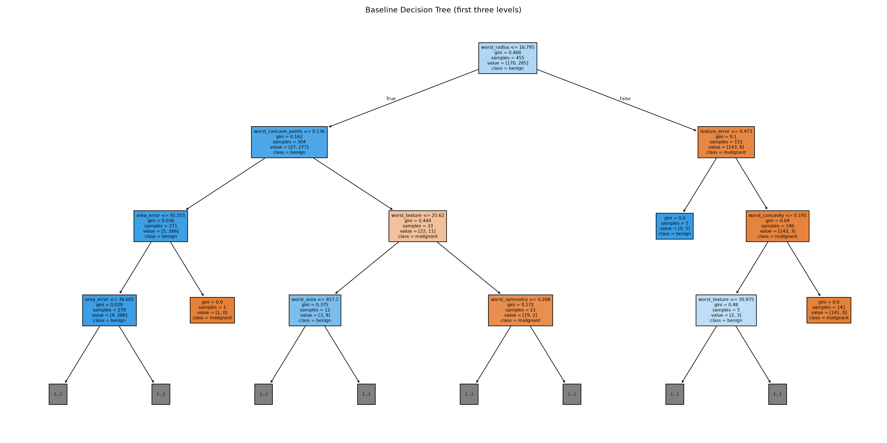

# Day 17: Decision Tree Classification

This project builds and evaluates a Decision Tree Classifier for the Wisconsin Diagnostic Breast Cancer dataset. The dataset is a public binary classification dataset available through scikit-learn and commonly mirrored on Kaggle. Using the packaged copy keeps the submission reproducible and avoids requiring Kaggle API credentials.

## Objective

The workflow demonstrates how a decision tree uses feature thresholds to classify observations. It evaluates Gini impurity, model performance, and the effect of restricting tree depth to understand underfitting and overfitting.

## Dataset

- **Samples:** 569
- **Features:** 30 numeric diagnostic measurements
- **Target:** `malignant` or `benign`
- **Missing values:** None in the source data; a median `SimpleImputer` is still included in the pipeline so preprocessing is explicit and robust.
- **Generated copy:** `data/breast_cancer.csv`

## Setup and Run

```bash
python -m pip install -r requirements.txt
python decision_tree_classification.py
```

The script writes the following artifacts:

- `outputs/baseline_metrics.csv`: training and testing accuracy, precision, recall, and F1 score
- `outputs/confusion_matrix.csv`: test-set confusion matrix
- `outputs/depth_experiment.csv`: comparison across maximum depths
- `outputs/confusion_matrix.png`: test-set confusion matrix visualization
- `outputs/depth_comparison.png`: training versus testing accuracy by depth
- `outputs/decision_tree.png`: first three levels of the fitted tree

## Results Screenshots

### Confusion Matrix



### Tree Depth Comparison



### Decision Tree Visualization



## Methodology

1. Load the dataset with Pandas after retrieving it from scikit-learn.
2. Inspect shape, class counts, and missing-value totals.
3. Separate the 30 features from the target.
4. Split the data into 80% training and 20% testing sets using stratification and `random_state=42`.
5. Train a `DecisionTreeClassifier` using the Gini criterion.
6. Generate test predictions and calculate accuracy, precision, recall, F1 score, and a confusion matrix.
7. Repeat training with maximum depths of 1, 2, 3, 4, 5, 7, and unlimited.

## Overfitting Analysis

Use `outputs/depth_experiment.csv` to compare the training and testing scores. A shallow tree can underfit because it cannot represent enough decision rules. As depth increases, training accuracy generally rises, while testing accuracy may stop improving or decline. The difference between training and testing accuracy is the generalization gap: a large gap indicates overfitting.

For this dataset, the most useful configuration is the depth with the strongest testing score and a modest generalization gap, rather than automatically choosing the unlimited tree. The generated table contains the exact values from the local run.

## Concepts

- **Gini impurity:** measures how mixed the classes are in a node. A split is preferred when it reduces impurity.
- **Entropy:** an alternative impurity measure based on information gain. It can be tested by changing `criterion="gini"` to `criterion="entropy"`.
- **Overfitting:** the tree memorizes training examples, producing a high training score but weaker test performance.
- **Underfitting:** the tree is too constrained and performs poorly on both training and testing data.

## References

- [DecisionTreeClassifier](https://scikit-learn.org/stable/modules/generated/sklearn.tree.DecisionTreeClassifier.html)
- [Decision Trees](https://scikit-learn.org/stable/modules/tree.html)
- [Classification Metrics](https://scikit-learn.org/stable/modules/model_evaluation.html)
- [Kaggle Datasets](https://www.kaggle.com/datasets)
