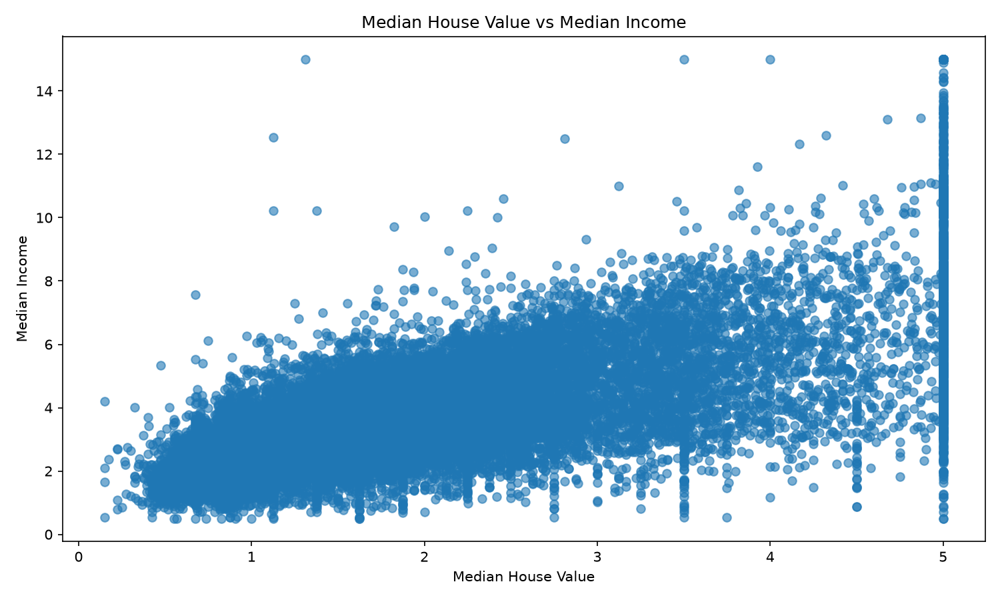
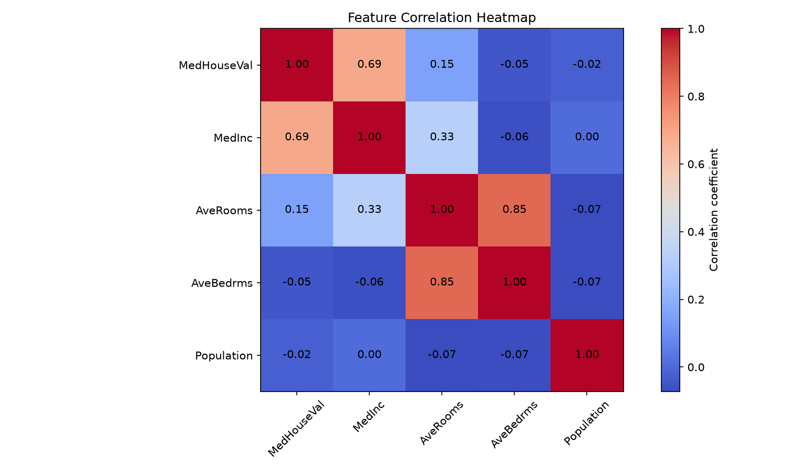
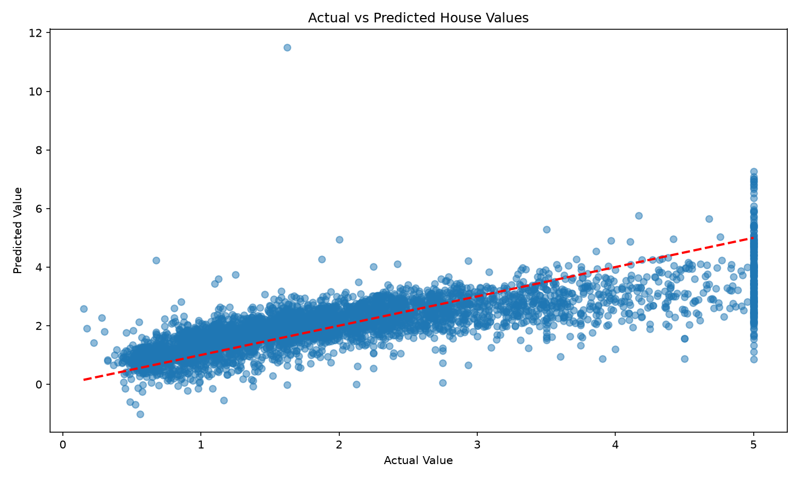

# Complete Regression Pipeline Project

This project builds a complete end-to-end regression workflow using a real-world housing price dataset. The workflow covers data loading, cleaning, exploratory data analysis, feature engineering, model training, evaluation, and prediction generation.

## Dataset

The project uses the California Housing dataset, a classic real-estate regression dataset that is widely used for machine learning benchmarking and Kaggle-style prediction tasks.

- Source: scikit-learn California Housing dataset
- Target variable: Median house value (`MedHouseVal`)
- Rows: 20,640
- Features: median income, average rooms, average bedrooms, population, and additional housing indicators

## Project Goals

- Perform data preparation and quality checks
- Explore feature relationships and summary statistics
- Train a Linear Regression model
- Evaluate with MAE, MSE, RMSE, and R² Score
- Save model output and visualizations

## Project Structure

- `regression_pipeline.py` — full data pipeline and model logic
- `main.py` — entry point to run the workflow
- `data/` — downloaded housing dataset
- `outputs/` — metrics, summaries, and charts
- `requirements.txt` — project dependencies

## Workflow

1. Load the dataset with Pandas
2. Clean missing values and inspect data types
3. Perform exploratory data analysis and summary statistics
4. Train a Linear Regression model
5. Evaluate model performance using regression metrics
6. Save plots and metric reports in the `outputs` folder

## Model Evaluation Metrics

The trained model metrics are recorded in `outputs/model_metrics.csv` and `outputs/model_summary.txt`.

- MAE: mean absolute error
- MSE: mean squared error
- RMSE: root mean squared error
- R²: coefficient of determination

## Visual Outputs

The following visuals are generated in the `outputs` folder:

- `house_value_vs_income.png`
- `feature_correlation.png`
- `prediction_vs_actual.png`

## Screenshots







## How to Run

```bash
python main.py
```

## Findings

The Linear Regression model shows the expected relationship between housing attributes and house value. Median income is one of the strongest predictors, and the model performs reasonably well for a baseline regression approach. The output plots highlight the positive relationship between income and property value, while the metric summary provides a numerical view of the model's predictive performance.

## Dependencies

Install the required libraries with:

```bash
pip install -r requirements.txt
```
