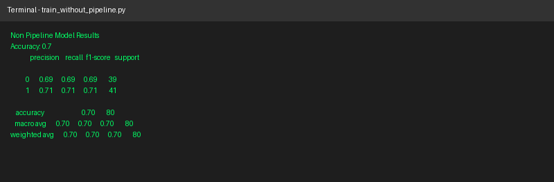
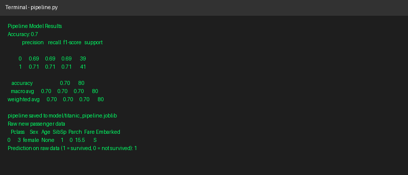
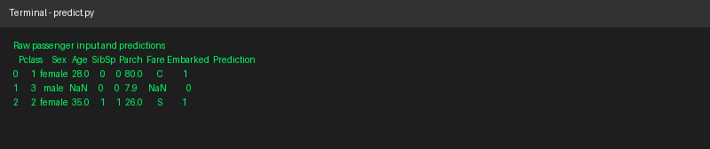
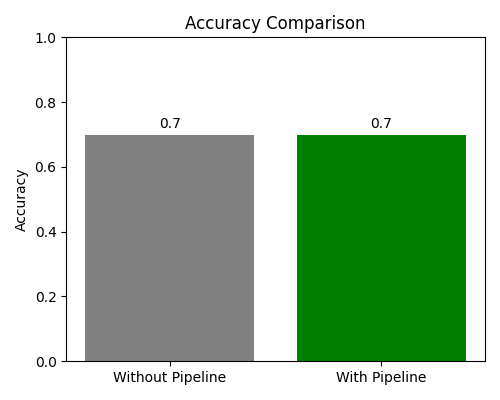

# Day 26 Task: Building a Reusable Machine Learning Pipeline

## Objective
This project automates a Machine Learning workflow using Scikit-Learn Pipeline and ColumnTransformer. The goal is to build a single reusable pipeline that takes in raw data, applies all preprocessing steps automatically, and generates predictions without any manual data preparation.

## Dataset
The dataset used is a Titanic style passenger dataset (`data/titanic.csv`) reused from a previous Machine Learning project. It has both numerical and categorical features, and it also contains missing values.

Columns:
- PassengerId
- Pclass (numerical)
- Sex (categorical)
- Age (numerical, has missing values)
- SibSp (numerical)
- Parch (numerical)
- Fare (numerical)
- Embarked (categorical, has missing values)
- Survived (target)

## Project Structure
```
ML_Pipeline_Project/
│
├── data/
│   └── titanic.csv
│
├── model/
│   └── titanic_pipeline.joblib
│
├── screenshots/
│   ├── screenshot_non_pipeline.png
│   ├── screenshot_pipeline.png
│   ├── screenshot_predict.png
│   └── accuracy_comparison.png
│
├── make_dataset.py
├── train_without_pipeline.py
├── pipeline.py
├── predict.py
├── requirements.txt
└── README.md
```

## Files Explained

### make_dataset.py
Creates the Titanic style dataset used in this project and saves it to `data/titanic.csv`.

### train_without_pipeline.py
This is the previous non-pipeline implementation. Missing values are filled manually, categorical columns are encoded manually with get_dummies, and numerical columns are scaled manually with StandardScaler. This is done step by step and not inside a pipeline.

### pipeline.py
This is the main task file. It builds a reusable pipeline:
- A numerical pipeline that fills missing values with the mean and scales the numbers.
- A categorical pipeline that fills missing values with the most frequent value and applies OneHotEncoder.
- A ColumnTransformer that applies the correct pipeline to the correct columns.
- A final Pipeline that combines the ColumnTransformer with a LogisticRegression model.

The pipeline is trained, evaluated, saved to `model/titanic_pipeline.joblib`, and then tested on one new raw passenger row to confirm it can handle raw data directly.

### predict.py
Loads the saved pipeline from disk and uses it to predict on new raw passenger data, including a row with missing values, to confirm the pipeline works end to end without any manual preprocessing.

## How to Run
```
pip install -r requirements.txt
python make_dataset.py
python train_without_pipeline.py
python pipeline.py
python predict.py
```

## Model Evaluation and Comparison

| Approach | Accuracy |
|---|---|
| Without Pipeline (manual preprocessing) | 0.70 |
| With Pipeline (ColumnTransformer + Pipeline) | 0.70 |

Both approaches give the same accuracy because they use the same preprocessing logic and the same model. The important difference is not the accuracy, it is how the preprocessing is done.

### Observations and Findings
- The non-pipeline version needs manual steps in the correct order every time, which is easy to mess up, for example forgetting to fill missing values before scaling.
- The pipeline version handles missing values, encoding, and scaling automatically inside one object.
- The pipeline can accept raw data directly, even rows with missing values, and still return a prediction without any extra code.
- The pipeline can be saved with joblib and reused later in `predict.py` without retraining, which is not easily possible with the manual approach.
- Overall, the pipeline approach is more reusable, cleaner, and safer against mistakes, even though the accuracy is the same in this case.

## Screenshots

### Training without pipeline


### Training with pipeline


### Prediction using saved pipeline on raw data


### Accuracy comparison


## Conclusion
The reusable pipeline built with Scikit-Learn Pipeline and ColumnTransformer successfully automates the full workflow from raw data to prediction. It removes the need for manual preprocessing steps, reduces the chance of errors, and makes the whole workflow easier to maintain and reuse in the future.
