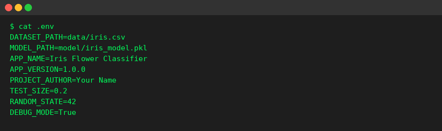
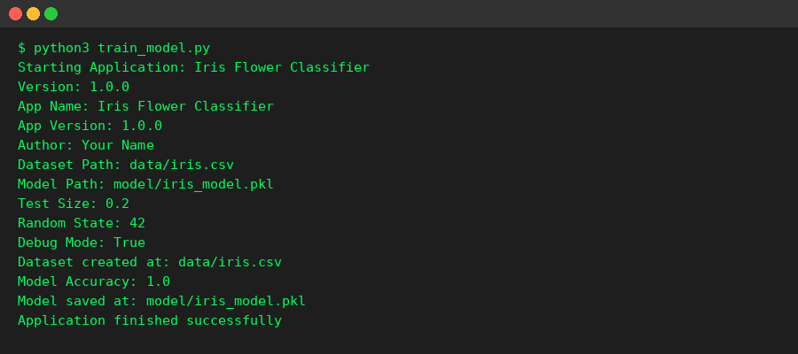
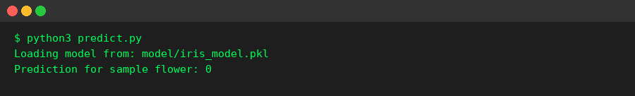
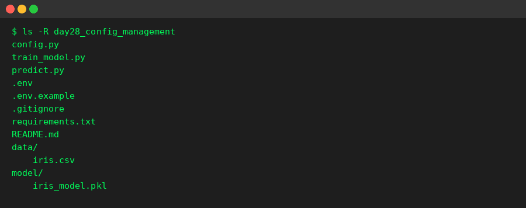

# Day 28 Task - Configuration Management & Environment Variables

This project is a simple Machine Learning application (Iris Flower Classifier) that has been refactored to remove hardcoded values and use environment variables and a configuration file instead.

## What Was Hardcoded Before

Before this task, the project code had these values written directly inside the Python files:
- Dataset path
- Model save path
- Test size for splitting data
- Random state for reproducibility
- Application name and version
- Author name

## What Was Changed

1. All these values were moved into a `.env` file.
2. A `config.py` file was created to load these values using `python-dotenv` and the `os` module.
3. `train_model.py` and `predict.py` now import `config.py` and use the values from there instead of hardcoding them.
4. `.env` was added to `.gitignore` so it is never pushed to GitHub.
5. A `.env.example` file was added so other developers know which variables are required, without exposing real values.

## Project Structure

```
day28_config_management/
├── config.py
├── train_model.py
├── predict.py
├── .env
├── .env.example
├── .gitignore
├── requirements.txt
├── README.md
└── screenshots/
```

## Environment Variables Used

| Variable | Description |
|---|---|
| DATASET_PATH | Path where the dataset csv file is stored |
| MODEL_PATH | Path where the trained model file is saved |
| APP_NAME | Name of the application |
| APP_VERSION | Current version of the application |
| PROJECT_AUTHOR | Name of the project author |
| TEST_SIZE | Fraction of data used for testing |
| RANDOM_STATE | Random seed used for train/test split |
| DEBUG_MODE | Turns debug printing on or off |

## Setup Instructions

1. Clone the repository
```
git clone <your-repo-url>
cd day28_config_management
```

2. Create a virtual environment (optional but recommended)
```
python3 -m venv venv
source venv/bin/activate
```

3. Install the required packages
```
pip install -r requirements.txt
```

4. Create your own `.env` file by copying the example file
```
cp .env.example .env
```

5. Open `.env` and set your own values if needed

6. Run the training script
```
python3 train_model.py
```

7. Run the prediction script
```
python3 predict.py
```

## Security Notes

- The `.env` file is excluded from version control using `.gitignore`.
- No passwords, API keys, or sensitive information are stored directly in the code.
- Only `.env.example` (without real sensitive values) should be pushed to GitHub.

## Screenshots

### 1. Environment Variables File


### 2. Running train_model.py


### 3. Running predict.py


### 4. Final Project Structure


## Conclusion

By moving configuration values out of the code and into environment variables, this project is now easier to maintain, safer to share publicly, and can be configured differently for different environments (development, testing, production) without changing the source code.
