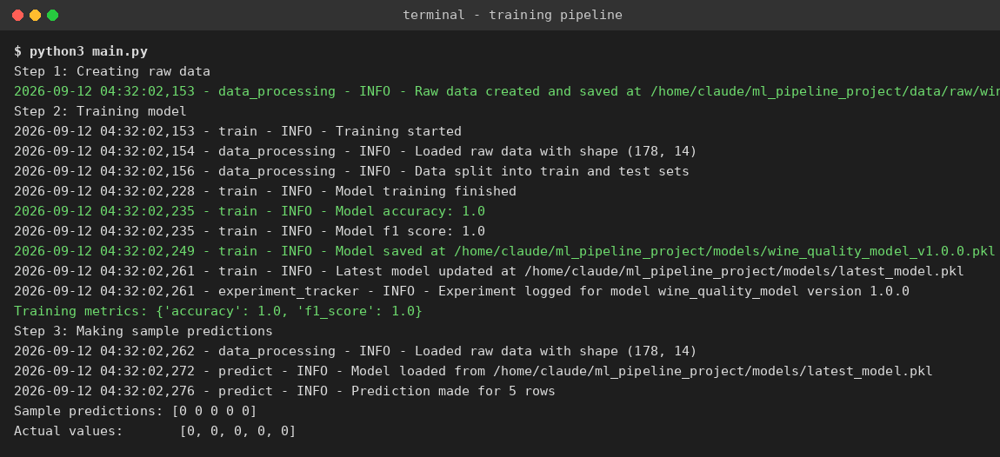
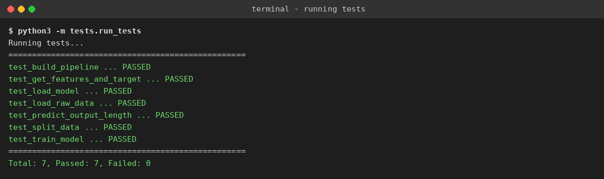
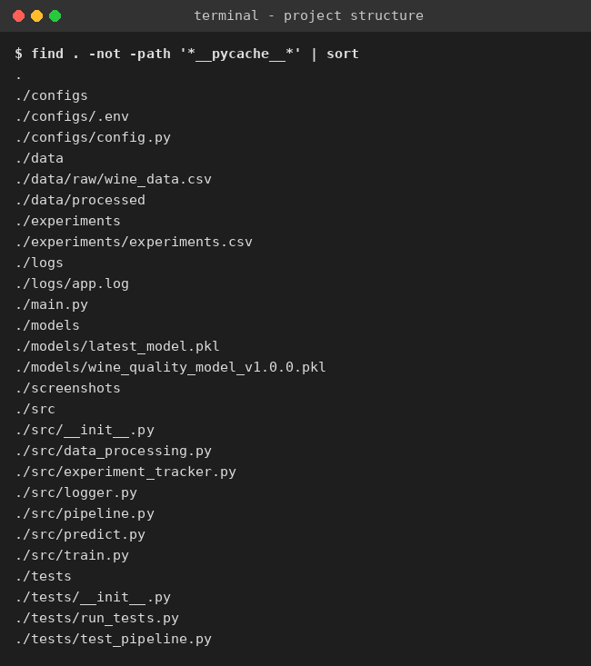
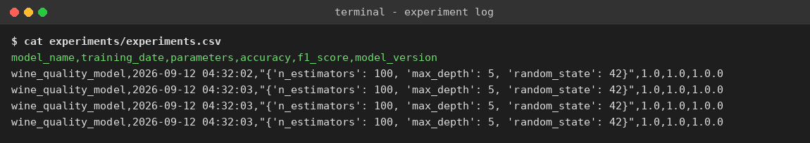

# Production Ready Machine Learning Pipeline

This project takes a simple Machine Learning model and turns it into a small production style system. It uses the Wine dataset from scikit-learn and trains a classifier that predicts the wine class from its chemical properties. The point of this project is not the dataset, it is the structure around it: pipeline, config, logging, testing, model saving and experiment tracking, all working together.

## Project Structure

```
ml_pipeline_project/
├── src/
│   ├── data_processing.py
│   ├── pipeline.py
│   ├── train.py
│   ├── predict.py
│   ├── experiment_tracker.py
│   └── logger.py
├── data/
│   ├── raw/
│   └── processed/
├── models/
├── configs/
│   ├── .env
│   └── config.py
├── tests/
│   ├── test_pipeline.py
│   └── run_tests.py
├── logs/
│   └── app.log
├── experiments/
│   └── experiments.csv
├── screenshots/
├── main.py
├── requirements.txt
└── README.md
```

## Architecture

The project is split into small pieces that each do one job.

1. **data_processing.py** creates the raw dataset, loads it, and splits it into train and test sets.
2. **pipeline.py** builds a single reusable Scikit-Learn `Pipeline` that scales the data and then runs it through a `RandomForestClassifier`. Because it is one Pipeline object, the same object handles preprocessing and the model together.
3. **train.py** runs the pipeline on the training data, checks accuracy and f1 score on the test data, saves the trained pipeline to disk with Joblib, and writes the run into the experiment log.
4. **predict.py** loads the saved pipeline from disk and uses it to predict on new raw data.
5. **experiment_tracker.py** appends every training run to a CSV file so past results are never lost.
6. **logger.py** sets up one shared logger that every module uses, so all activity ends up in `logs/app.log`.
7. **configs/config.py** reads `configs/.env` and exposes settings like model version, test size and random state, so nothing important is hardcoded in the code.

The flow for a normal run looks like this:

```
raw data -> train/test split -> Pipeline(Scaler + RandomForest) -> trained model saved to models/
                                                              -> metrics saved to experiments/experiments.csv
                                                              -> everything logged to logs/app.log
```

## Configuration

All settings are stored in `configs/.env` and loaded through `python-dotenv`. Nothing is hardcoded in the source files.

| Variable | Meaning |
|---|---|
| MODEL_DIR | folder where trained models are stored |
| DATA_DIR | folder where raw and processed data are stored |
| LOG_DIR / LOG_FILE | where log files are written |
| MODEL_NAME | base name used when saving the model |
| MODEL_VERSION | version tag attached to the saved model file |
| TEST_SIZE | fraction of data used for testing |
| RANDOM_STATE | seed used for reproducible results |
| N_ESTIMATORS | number of trees for the Random Forest model |
| MAX_DEPTH | max depth of each tree |
| EXPERIMENT_FILE | path to the experiment tracking CSV file |

To change any behaviour of the project (model version, dataset split, model size) you only need to edit `configs/.env`, not the Python code.

## Setup Instructions

1. Clone the repository:
```
git clone <your-repo-url>
cd ml_pipeline_project
```

2. Create a virtual environment (optional but recommended):
```
python -m venv venv
source venv/bin/activate
```

3. Install the requirements:
```
pip install -r requirements.txt
```

4. Run the full pipeline (creates data, trains the model, saves it, makes a sample prediction):
```
python main.py
```

5. Train the model directly:
```
python -m src.train
```

6. Make predictions with the saved model:
```
python -m src.predict
```

7. Run the tests with pytest:
```
pytest tests/
```

If `pytest` is not available in your environment, a plain fallback runner is included and does the same checks:
```
python -m tests.run_tests
```

## Model Management

Every time training runs, the pipeline is saved twice inside `models/`:

- `wine_quality_model_v<version>.pkl` — a version tagged copy, so old versions are not overwritten
- `latest_model.pkl` — always the most recently trained model, used by `predict.py`

The version number comes from `MODEL_VERSION` in `configs/.env`, so bumping the version for a new model is a one line change.

## Testing

Tests live in `tests/test_pipeline.py` and cover:

- raw data loads correctly
- features and target are split correctly
- train/test split produces the right sizes
- the pipeline has both a scaler step and a model step
- training produces a valid accuracy score
- the saved model can be loaded back
- predictions return the expected number of results

All 7 tests pass. See `screenshots/02_tests_passing.png`.

## Logging

Every module logs through `src/logger.py` into `logs/app.log`. This includes:

- when raw data is created or loaded
- when training starts and finishes
- accuracy and f1 score after training
- where the model was saved
- warnings, such as when raw data is missing and gets regenerated
- errors, such as trying to predict before any model has been trained

## Experiment Tracking

Every training run appends one row to `experiments/experiments.csv` with:

- Model Name
- Training Date
- Parameters Used
- Accuracy and F1 Score
- Model Version

This means every run is kept in history, and results can be compared across versions later.

## Results

On the Wine dataset, the Random Forest pipeline reaches:

- **Accuracy:** 1.0
- **F1 Score:** 1.0

(The Wine dataset is small and clean, which is why the score is this high. The point of this project is the pipeline structure around the model, which would work the same way with a larger, messier dataset.)

## Screenshots

**Full pipeline run (main.py)**



**Tests passing**



**Project structure**



**Experiment tracking log**



## Notes

- The dataset used is the built in Wine dataset from `sklearn.datasets`, so the project runs with no external downloads and no internet connection needed.
- To extend this project to a different dataset or model, only `src/data_processing.py` and `src/pipeline.py` need to change. Everything else (training loop, logging, config, tracking) stays the same.
