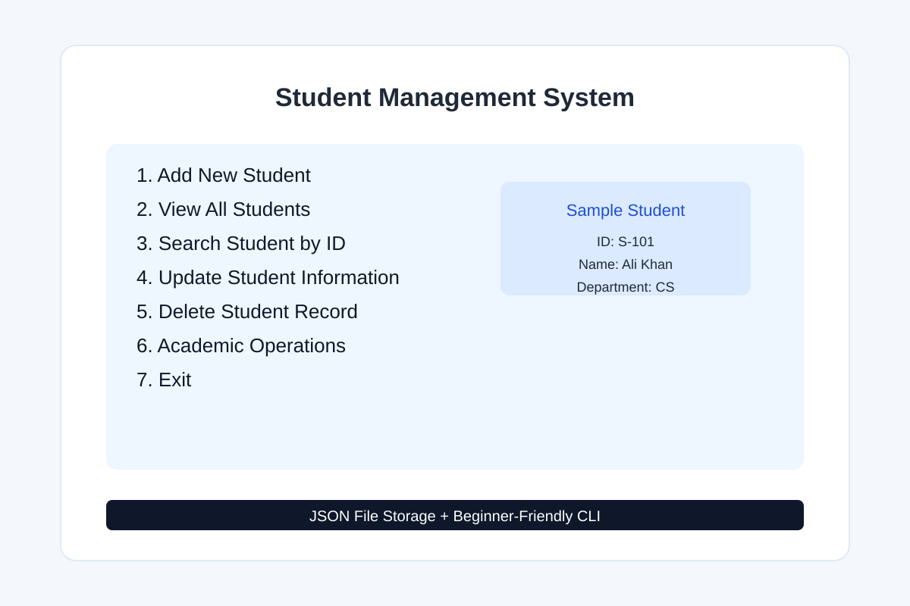

# Student Management System

A beginner-friendly Python project for managing student records using a command-line menu and JSON file storage.

## Features

- Add new students
- View all student records
- Search student by ID
- Update student information
- Delete student records
- Add marks for each student
- Calculate total marks
- Calculate percentage
- Generate grade
- Display academic status
- Save data permanently in a JSON file

## Project Structure

- main.py
- app/
  - __init__.py
  - student_data.py
  - student_manager.py
- data/
  - students.json
- docs/
  - screenshots/
    - student_management_system.svg

## Technologies Used

- Python
- JSON file handling
- Functions and modules
- Loops and conditionals
- Exception handling

## How to Run

1. Open the project folder.
2. Run the application using Python:

```bash
python main.py
```

## Screenshot



## Learning Outcome

This project helps learners practice:

- Python fundamentals
- Conditional statements
- Loops
- Functions
- Modules
- File handling
- JSON data storage
- Exception handling

## Note

This project is designed for students who are learning Python in a simple and clear way.
