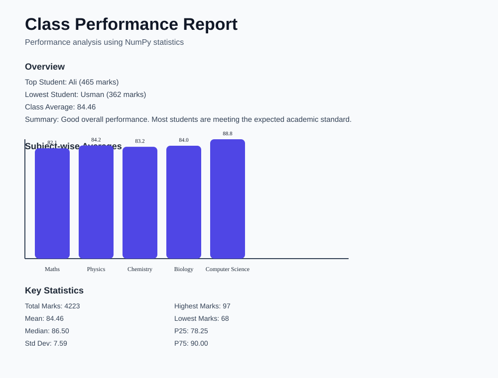
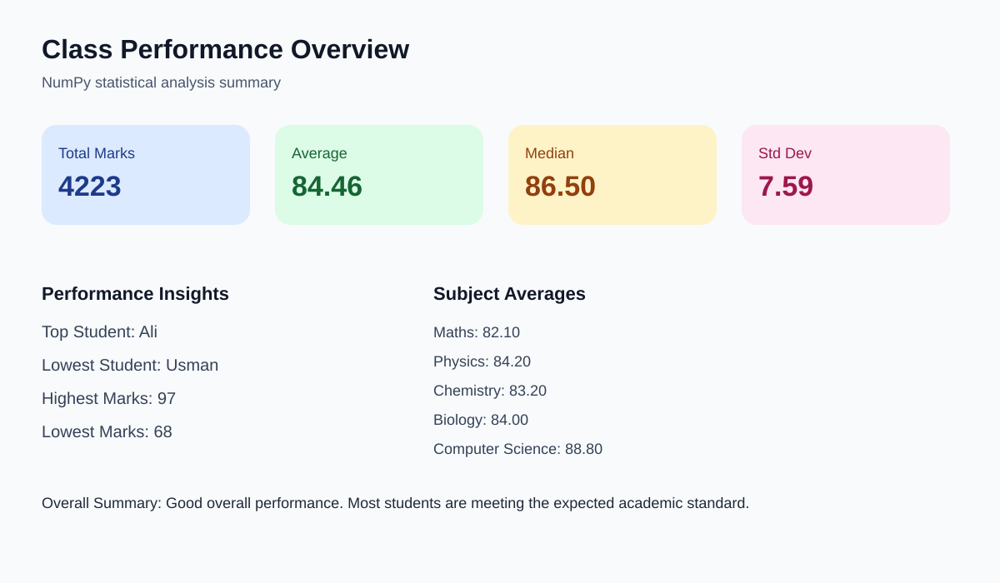

# Class Performance Report System

A NumPy-based Python project that analyzes a class dataset of marks across multiple subjects and generates a structured performance report with statistical summaries and insights.

## Objective

This project demonstrates how to use NumPy statistics for data analysis in educational performance evaluation. It calculates total marks, average marks, mean, median, standard deviation, percentile values, and identifies top and lowest-performing students.

## Features

- Dataset with 10 students and 5 subjects
- Reusable functions for statistical calculations
- Subject-wise performance analysis
- Top and lowest student identification
- Overall class performance summary
- Structured console report and SVG performance preview

## Project Structure

- `class_performance_report.py` — main report generation script
- `output/report_preview.svg` — visual summary of class performance

## How to Run

1. Open a terminal in the project folder.
2. Run:

```bash
python class_performance_report.py
```

3. The report will be printed to the console and a summary chart will be saved to `output/report_preview.svg`.

## Sample Output




## Statistical Functions Used

The implementation uses NumPy functions such as:

- `np.sum`
- `np.mean`
- `np.median`
- `np.std`
- `np.min`
- `np.max`
- `np.percentile`

## Example Report Summary

- Total Marks: 4223
- Mean: 84.46
- Median: 86.50
- Standard Deviation: 7.59
- Highest Marks: 97
- Lowest Marks: 68
- Top Student: Ali
- Lowest Student: Usman

## Notes

This project is designed as a practical exercise for learning data analysis with NumPy and can be extended with CSV import, visual charts, or a web interface.
