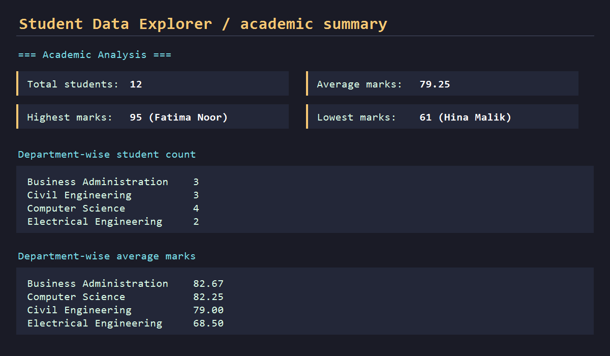

# Student Data Explorer

A Pandas fundamentals project for loading, exploring, filtering, sorting, and analyzing student academic data.

## Dataset

`students.csv` contains 12 students and these fields:

- Student ID
- Student Name
- Department
- Semester
- Age
- Marks
- Attendance Percentage

## Requirements

- Python 3.9+
- Pandas

Install the dependency:

```bash
python -m pip install -r requirements.txt
```

## Run

From this directory:

```bash
python student_data_explorer.py
```

The explorer uses default filters of marks greater than `80` and the `Computer Science` department. Custom values can be supplied:

```bash
python student_data_explorer.py --minimum-marks 85 --department "Civil Engineering"
```

A custom CSV path is also supported:

```bash
python student_data_explorer.py --file path/to/students.csv
```

## Features Demonstrated

- Loads CSV data into a Pandas DataFrame with `read_csv`.
- Displays the first and last five records.
- Inspects dataset information, column names, and data types.
- Filters by marks and department.
- Sorts by marks and attendance percentage.
- Calculates total students, average, highest, and lowest marks.
- Produces department-wise counts and average marks.
- Keeps each operation in a reusable function.

## Output Preview

Running the script prints readable sections for every required operation, including the following summary for the included dataset:

```text
Total students: 12
Average marks: 79.25
Highest marks: 95 (Fatima Noor)
Lowest marks: 61 (Hina Malik)
```

## Screenshot

The generated output summary is captured below:



## Learning Resources

- [Pandas Documentation](https://pandas.pydata.org/docs/)
- [Pandas Getting Started](https://pandas.pydata.org/docs/getting_started/index.html)
- [Pandas DataFrame](https://pandas.pydata.org/docs/reference/api/pandas.DataFrame.html)
- [Reading CSV Files](https://pandas.pydata.org/docs/reference/api/pandas.read_csv.html)
