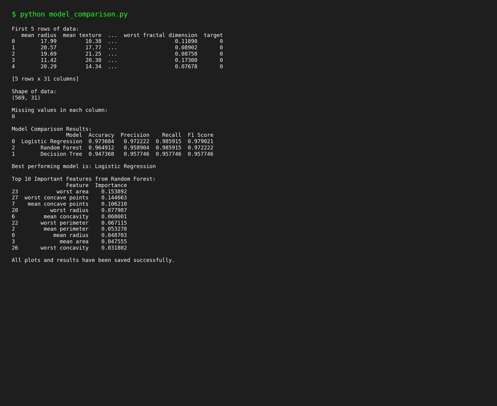
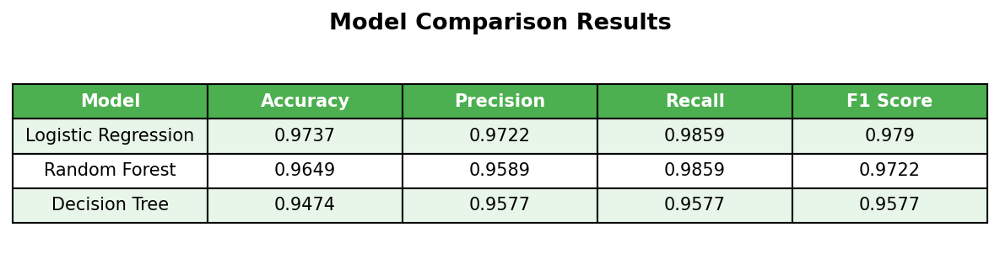
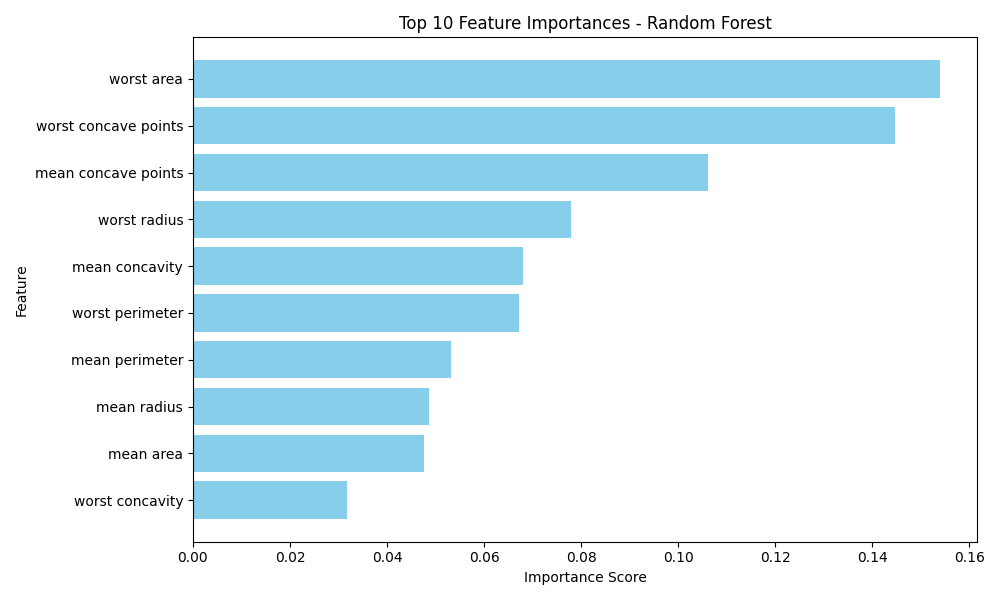
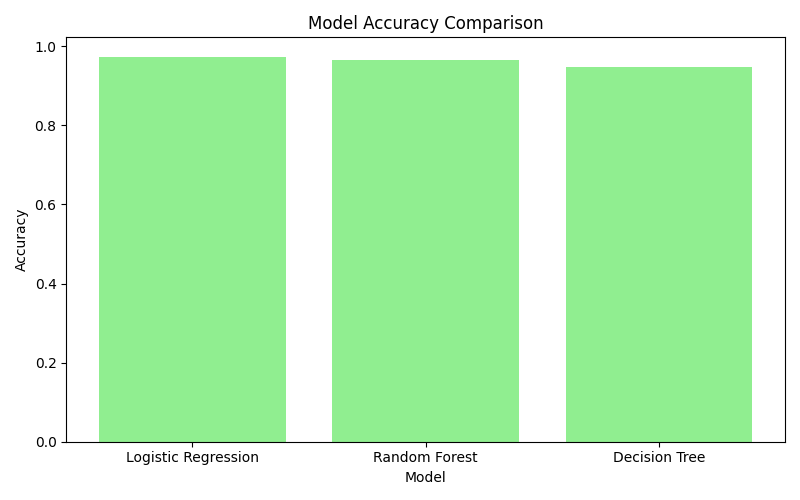

# Day 19 Task: Model Comparison using Random Forest

## Objective
Learn how ensemble learning works through Random Forest and understand how model performance can vary across different algorithms. Gain practical experience comparing multiple Machine Learning models and analyzing feature importance.

## Dataset
This project uses the Breast Cancer Wisconsin dataset. It is a classification dataset that is also available on Kaggle here:
https://www.kaggle.com/datasets/uciml/breast-cancer-wisconsin-data

The dataset has 569 rows and 31 columns. The target column tells us if a tumor is malignant (0) or benign (1). The file used in this project is saved at `data/breast_cancer_dataset.csv`.

## Project Structure
```
Day19_Model_Comparison_RandomForest/
│
├── data/
│   └── breast_cancer_dataset.csv
│
├── plots/
│   ├── feature_importance.png
│   └── model_accuracy_comparison.png
│
├── results/
│   ├── model_comparison_results.csv
│   └── feature_importance.csv
│
├── model_comparison.py
└── README.md
```

## Steps Followed

### 1. Data Preparation
- Loaded the dataset using Pandas.
- Checked the shape and first 5 rows of the data.
- Checked for missing values (there were none, but the code still handles missing values by dropping them if found).
- Split the data into features (X) and target (y).
- Split the data into training set and testing set using an 80/20 split.
- Used StandardScaler to scale the data for Logistic Regression.

### 2. Model Development
Three models were trained on the same dataset:
1. Logistic Regression (since this is a classification problem)
2. Decision Tree
3. Random Forest

### 3. Model Comparison
Each model was evaluated using Accuracy, Precision, Recall and F1 Score.

| Model | Accuracy | Precision | Recall | F1 Score |
|---|---|---|---|---|
| Logistic Regression | 0.9737 | 0.9722 | 0.9859 | 0.9790 |
| Random Forest | 0.9649 | 0.9589 | 0.9859 | 0.9722 |
| Decision Tree | 0.9474 | 0.9577 | 0.9577 | 0.9577 |

**Ranking (Best to Worst):**
1. Logistic Regression
2. Random Forest
3. Decision Tree

### Strengths and Weaknesses

**Logistic Regression**
- Strength: Simple, fast, and worked very well on this scaled dataset.
- Weakness: Assumes a linear relationship between features and target, may not work well on more complex data.

**Decision Tree**
- Strength: Easy to understand and visualize, does not need scaling.
- Weakness: Can easily overfit the training data, which is why it got the lowest accuracy here.

**Random Forest**
- Strength: Combines many decision trees so it reduces overfitting and gives more stable results than a single Decision Tree.
- Weakness: Slower to train than a single Decision Tree and harder to interpret since it uses many trees.

### Best Performing Model
Based on accuracy, **Logistic Regression** performed the best on this dataset. However, **Random Forest** is a close second and is generally more reliable on larger or more complex datasets because it is an ensemble model.

## Feature Importance (from Random Forest)
The top 10 most important features according to the Random Forest model are:

| Feature | Importance |
|---|---|
| worst area | 0.1539 |
| worst concave points | 0.1447 |
| mean concave points | 0.1062 |
| worst radius | 0.0780 |
| mean concavity | 0.0680 |
| worst perimeter | 0.0671 |
| mean perimeter | 0.0533 |
| mean radius | 0.0487 |
| mean area | 0.0476 |
| worst concavity | 0.0318 |

This shows that features like `worst area` and `worst concave points` have the biggest influence on whether a tumor is predicted as malignant or benign.

## Screenshots

### Terminal Output


### Model Comparison Results Table


### Feature Importance Chart


### Model Accuracy Comparison Chart


## How to Run
1. Make sure Python is installed with these libraries: pandas, numpy, matplotlib, scikit-learn.
2. Open a terminal inside this folder.
3. Run the script:
```
python model_comparison.py
```
4. The results will be printed in the terminal and saved inside the `results/` and `plots/` folders.

## Technologies Used
- Python
- Pandas and NumPy for data processing
- Matplotlib for visualization
- Scikit-Learn for model training and evaluation

## Conclusion
This task helped in understanding how ensemble learning (Random Forest) compares to simpler models like Logistic Regression and Decision Tree. It also showed how to extract and visualize feature importance to understand which features matter most for predictions.
