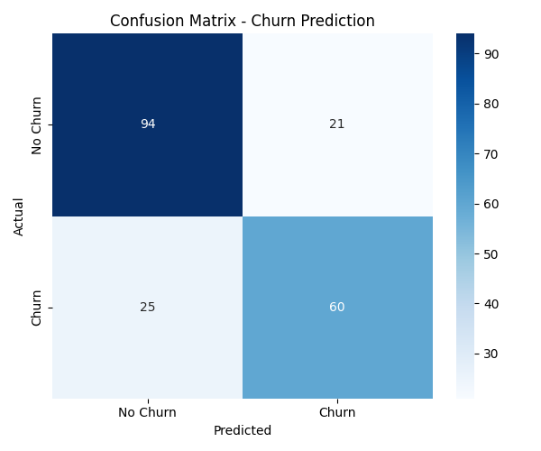
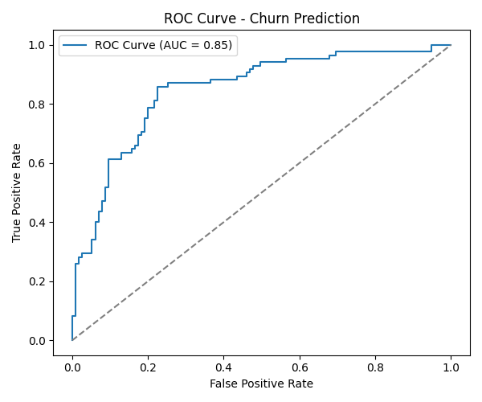
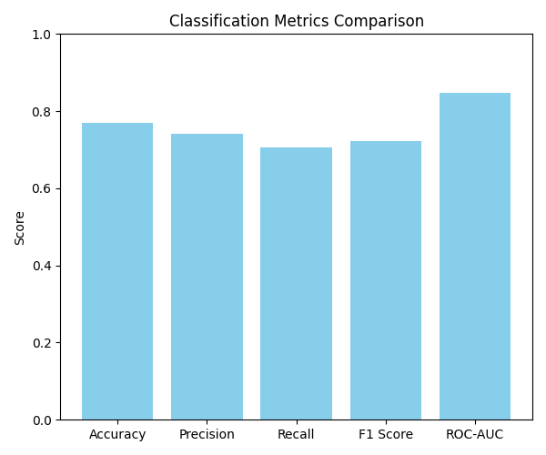
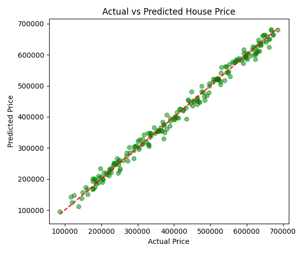
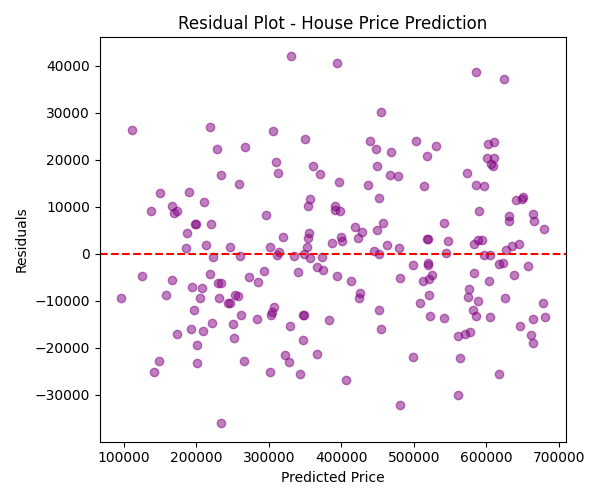
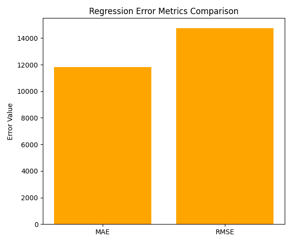

# Day 21 Task: Model Evaluation & Performance Analysis

## Objective
Learn how to evaluate Machine Learning models using the correct metrics and understand why different business problems need different evaluation approaches. This task goes beyond just checking accuracy and looks at the full performance picture of both a classification model and a regression model.

## Dataset
Since Day 19 and Day 20 files were not available, this task rebuilds both models from scratch using the same style of data so the evaluation part can be shown fully working:

- `classification_model.py` builds a **Customer Churn Prediction** dataset and trains a Logistic Regression model.
- `regression_model.py` builds a **House Price Prediction** dataset and trains a Linear Regression model.

Both scripts save the trained model, the scaler, and the test data so the evaluation scripts can load them separately.

## Project Files

```
Day21_Model_Evaluation/
│
├── classification_model.py        (trains churn model - classification)
├── regression_model.py            (trains house price model - regression)
├── evaluate_classification.py     (evaluates classification model)
├── evaluate_regression.py         (evaluates regression model)
├── churn_dataset.csv
├── house_dataset.csv
├── churn_model.pkl
├── churn_scaler.pkl
├── house_model.pkl
├── house_scaler.pkl
├── churn_X_test.csv
├── churn_y_test.csv
├── house_X_test.csv
├── house_y_test.csv
├── classification_results.csv
├── regression_results.csv
├── screenshots/
│   ├── confusion_matrix.png
│   ├── roc_curve.png
│   ├── classification_metrics_bar.png
│   ├── actual_vs_predicted.png
│   ├── residual_plot.png
│   └── regression_metrics_bar.png
└── README.md
```

## How to Run
```
python classification_model.py
python evaluate_classification.py

python regression_model.py
python evaluate_regression.py
```

---

## Classification Model Results (Customer Churn Prediction)

| Metric | Score |
|--------|-------|
| Accuracy | 0.77 |
| Precision | 0.74 |
| Recall | 0.71 |
| F1 Score | 0.72 |
| ROC-AUC | 0.85 |

**Confusion Matrix**



**ROC Curve**



**Metrics Comparison**



### What each metric tells us
- **Accuracy (0.77):** Out of all customers, the model correctly predicted churn or no-churn 77% of the time. On its own this number can be misleading if the classes are not balanced.
- **Precision (0.74):** When the model predicts a customer will churn, it is correct 74% of the time. This tells us how much we can trust a "churn" alert.
- **Recall (0.71):** Out of all customers who actually churned, the model managed to catch 71% of them. This tells us how good the model is at not missing churners.
- **F1 Score (0.72):** A balance between precision and recall. Useful when both false positives and false negatives matter.
- **ROC-AUC (0.85):** Shows how well the model separates churners from non-churners across all thresholds. A score of 0.85 means the model is doing a good job overall, well above the 0.5 random guess line.
- **Confusion Matrix:** Shows 94 correct no-churn predictions, 60 correct churn predictions, 21 customers wrongly predicted as churn, and 25 churners the model missed.

### Strengths
- Good ROC-AUC score shows strong separation between the two classes.
- Precision and recall are fairly balanced, so the model is not biased too heavily toward one type of error.

### Weaknesses
- Recall of 0.71 means the model still misses close to 3 out of 10 real churn cases, which can be costly for a churn-prevention business use case.
- Accuracy alone would have looked fine even if the model had ignored the minority class, which is why precision, recall, and ROC-AUC were also checked.

### Is the model suitable?
The model is reasonably suitable as a first version. For a real churn prevention system, recall should ideally be pushed higher since missing a churner is usually more costly than a false alarm, but this model gives a solid baseline.

---

## Regression Model Results (House Price Prediction)

| Metric | Score |
|--------|-------|
| MAE | 11,805.78 |
| MSE | 217,863,279.25 |
| RMSE | 14,760.19 |
| R² Score | 0.9917 |

**Actual vs Predicted Price**



**Residual Plot**



**Error Metrics Comparison**



### What each metric tells us
- **MAE (11,805.78):** On average, the model's price prediction is off by about $11,805. This is easy to explain to non-technical people since it is in the same unit as the price itself.
- **MSE (217,863,279.25):** Squares the errors before averaging, which makes larger mistakes count for much more. It is harder to interpret directly but useful for comparing models.
- **RMSE (14,760.19):** Brings the squared error back to the original price unit. RMSE is higher than MAE here, which tells us there are a few larger errors pulling the average up.
- **R² Score (0.9917):** The model explains about 99% of the variation in house prices using the given features. This is a very strong result.

### Strengths
- Very high R² score shows the features chosen (area, bedrooms, bathrooms, age, distance to city) explain house price very well.
- MAE and RMSE are both small compared to typical house prices, so predictions are usable in practice.

### Weaknesses
- RMSE being noticeably higher than MAE means a few predictions have larger errors than the rest, so the model is not equally accurate for every house.
- The model was trained on synthetic data with a mostly linear relationship, so a real-world dataset with more noise and non-linear patterns may not perform this well.

### Is the model suitable?
Yes, for this dataset the regression model is very suitable. The high R² combined with reasonably small MAE and RMSE shows the model captures the pricing pattern well.

---

## Business Scenario Justifications

### 1. Customer Churn Prediction
**Most important metric: Recall**
In churn prediction, the biggest cost to the business is losing a customer without doing anything about it. Missing a real churner (a false negative) means the business loses that customer's future revenue completely. A false alarm (predicting churn when the customer was actually staying) only costs a small retention offer. Because of this, recall is prioritized over precision so that as many real churners as possible are caught, even if it means contacting a few extra customers who were not actually going to leave.

### 2. Fraud Detection
**Most important metric: Recall (with attention to Precision through F1 or ROC-AUC)**
In fraud detection, missing a fraudulent transaction (false negative) can directly cause financial loss, so recall is critical. However, precision cannot be ignored either, because flagging too many normal transactions as fraud (false positives) annoys customers and increases manual review workload. This is why fraud detection systems usually look at F1 Score or ROC-AUC together with recall, to balance catching fraud without overwhelming the system with false alarms.

### 3. House Price Prediction
**Most important metric: RMSE (with R² as a supporting metric)**
House price prediction is a regression problem, so metrics like MAE, MSE, RMSE, and R² apply instead of classification metrics. RMSE is usually preferred here because it penalizes large errors more heavily, and in pricing, a large mistake (predicting a house is worth $50,000 more or less than it actually is) is much more damaging than several small mistakes. R² is used alongside RMSE to check how well the model explains price variation overall, but RMSE is the metric that most directly reflects the real financial risk of a bad prediction.

---

## Final Notes
- Both models were evaluated using Scikit-Learn's built-in evaluation metrics.
- Classification was evaluated using Accuracy, Precision, Recall, F1 Score, Confusion Matrix, and ROC-AUC.
- Regression was evaluated using MAE, MSE, RMSE, and R² Score.
- Screenshots of all plots are included in the `screenshots/` folder and embedded above.
- This completes the Day 21 Model Evaluation & Performance Analysis task.
