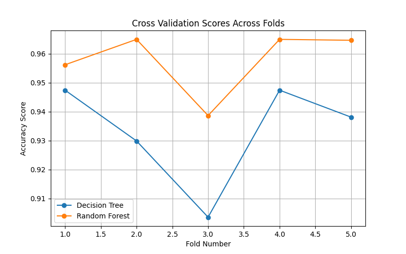
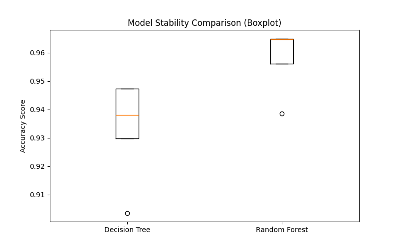
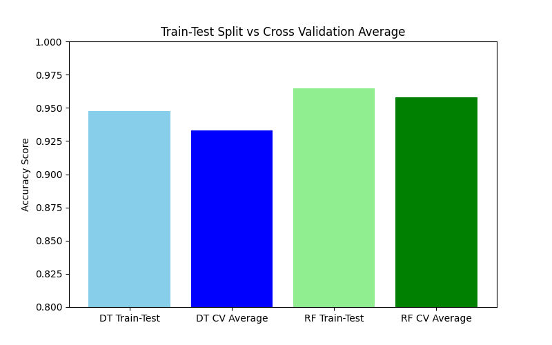

# Day 22 Task: Cross-Validation & Model Comparison

## Objective
Understand how Cross-Validation helps evaluate Machine Learning models more reliably
compared to a single train-test split, and compare model performance across multiple
validation folds using two Machine Learning models.

## Dataset
Breast Cancer Wisconsin Dataset (loaded directly from Scikit-Learn's built-in datasets).
- Total Samples: 569
- Total Features: 30
- Target: 0 = Malignant, 1 = Benign

## Models Used
1. Decision Tree Classifier
2. Random Forest Classifier

## Project Structure
```
Day22_CrossValidation_ModelComparison/
│
├── cross_validation_comparison.py
├── README.md
├── results/
│   ├── cv_results.csv
│   └── summary_results.csv
└── screenshots/
    ├── fold_scores_comparison.png
    ├── model_stability_boxplot.png
    └── traintest_vs_cv_comparison.png
```

## Step 1: Single Train-Test Split Results
| Model         | Accuracy |
|---------------|----------|
| Decision Tree | 0.9474   |
| Random Forest | 0.9649   |

## Step 2: K-Fold Cross-Validation (5 Folds)

### Decision Tree Fold Scores
| Fold | Score  |
|------|--------|
| 1    | 0.9474 |
| 2    | 0.9298 |
| 3    | 0.9035 |
| 4    | 0.9474 |
| 5    | 0.9381 |

Average Score: **0.9332**
Standard Deviation: **0.0162**

### Random Forest Fold Scores
| Fold | Score  |
|------|--------|
| 1    | 0.9561 |
| 2    | 0.9649 |
| 3    | 0.9386 |
| 4    | 0.9649 |
| 5    | 0.9646 |

Average Score: **0.9578**
Standard Deviation: **0.0102**

## Step 3: Model Comparison Table
| Model         | Train-Test Accuracy | CV Average Score | CV Std Deviation |
|---------------|----------------------|-------------------|-------------------|
| Decision Tree | 0.9474               | 0.9332            | 0.0162            |
| Random Forest | 0.9649               | 0.9578            | 0.0102            |

## Screenshots

### Fold Scores Comparison


### Model Stability Boxplot


### Train-Test Split vs Cross-Validation Average


## Observations

1. Both models scored differently on each fold, which shows that a single train-test
   split can be misleading because it only checks the model on one specific portion
   of data.
2. Decision Tree scores varied more across folds (lowest fold score 0.9035, highest
   0.9474), showing that it is more sensitive to which part of the data is used for
   training and testing.
3. Random Forest scores stayed more consistent across folds (between 0.9386 and
   0.9649), which means it generalizes better on unseen data.
4. Random Forest has both a higher average Cross-Validation score (0.9578) and a
   lower standard deviation (0.0102) compared to Decision Tree (0.9332 average,
   0.0162 std deviation).

## Most Stable Model
**Random Forest** is the most stable model because it has the lowest standard
deviation across the 5 folds, meaning its performance does not change much when
the training and testing data changes.

## Performance Analysis: Cross-Validation vs Train-Test Split

- The single train-test split gave slightly higher accuracy for both models compared
  to their Cross-Validation average, which happens because the train-test split only
  evaluates the model on one lucky (or unlucky) subset of data.
- Cross-Validation gives a more reliable evaluation because it tests the model on
  5 different combinations of training and testing data and then averages the
  results, reducing the effect of randomness from any single split.
- The variation between folds (for example, Decision Tree dropping to 0.9035 in
  Fold 3) shows that model performance can change depending on which rows end up
  in the training set versus the testing set. Cross-Validation captures this
  variation, while a single train-test split hides it.

## Conclusion
Cross-Validation gives a much clearer and more trustworthy picture of how a model
will perform on new, unseen data compared to a single train-test split. In this
task, Random Forest was found to be both the best performing model (highest average
Cross-Validation score) and the most stable model (lowest standard deviation across
folds), making it the preferred choice between the two models tested.

## How to Run
```
pip install scikit-learn pandas matplotlib
python cross_validation_comparison.py
```

## Status
- [x] At least two Machine Learning models evaluated using Cross-Validation
- [x] Cross-Validation scores for all folds recorded
- [x] Model comparison and stability analysis completed
- [x] Observations and conclusions documented
- [x] README.md updated with results, analysis, and screenshots
