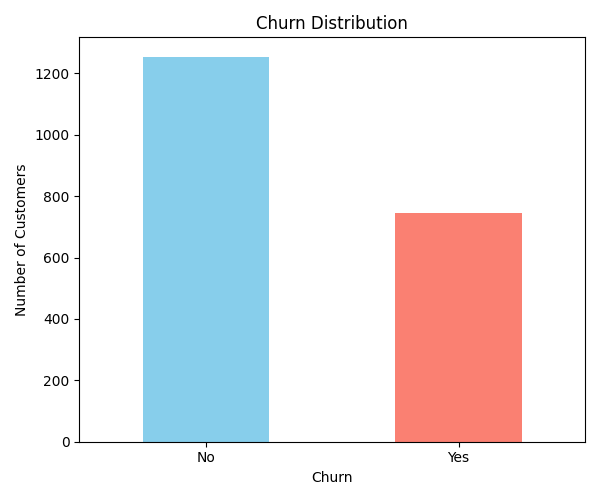
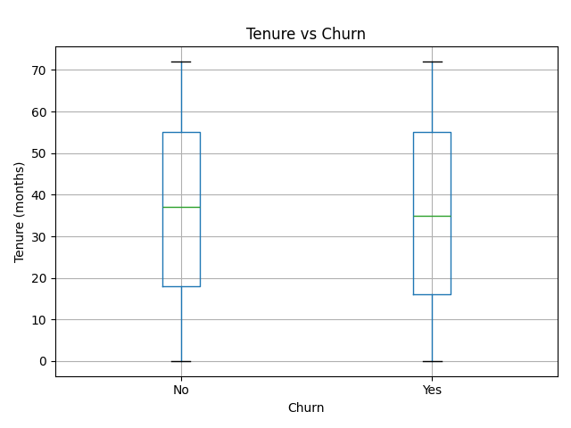
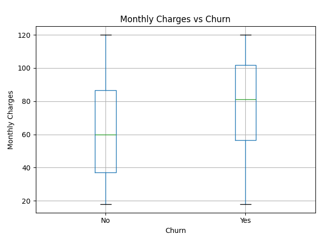
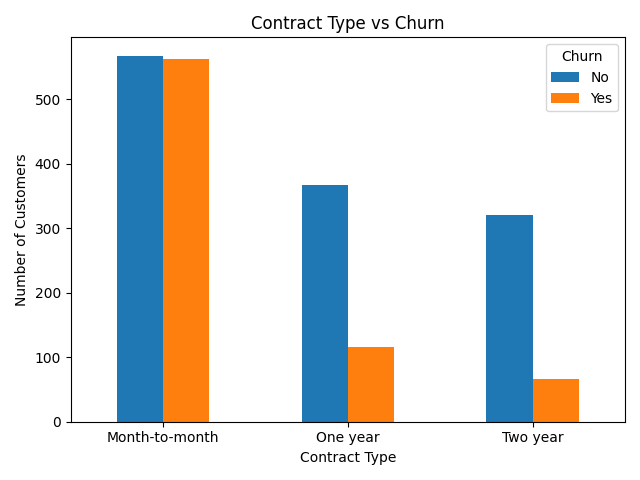
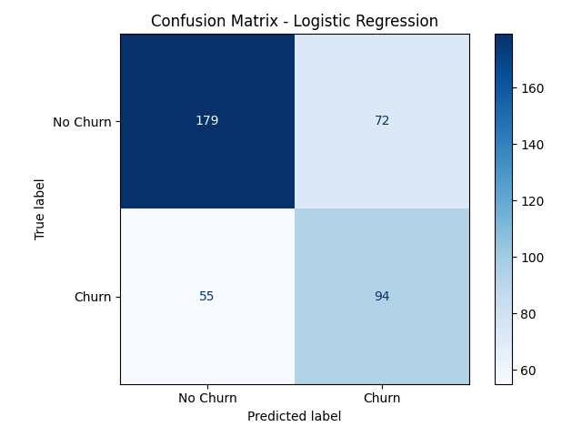
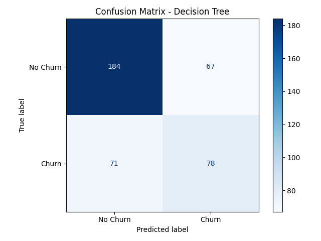
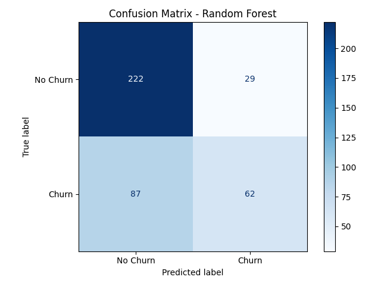
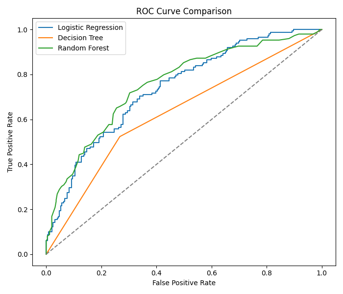
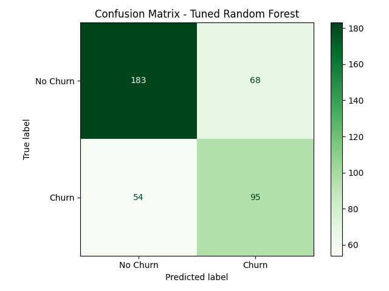
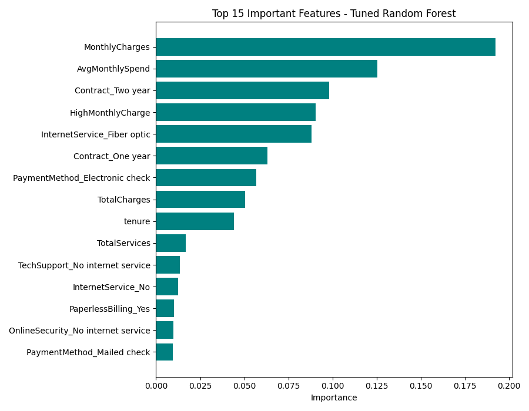

# Customer Churn Prediction System

Day 24 Task - Week 4 Machine Learning Project

## Project Overview
This project predicts whether a customer will churn (leave a service) using
customer account and service information. It covers the full ML workflow:
data cleaning, feature engineering, model training, evaluation, cross
validation, hyperparameter tuning, class imbalance handling, and experiment
tracking.

## Dataset
The project uses a Customer Churn dataset with the same structure as the
popular Kaggle "Telco Customer Churn" dataset (customer demographics,
account information, subscribed services, and a Churn target column).

Note: Since this environment does not have internet/Kaggle access, a
synthetic dataset (`data/churn_data.csv`, 2000 rows) was generated using
`generate_dataset.py` with the exact same columns and realistic churn
patterns (for example, month-to-month contracts and high monthly charges
increase churn probability, same as in the real Telco dataset). This keeps
the project fully reproducible without external downloads. To use the real
Kaggle dataset instead, simply download it from
https://www.kaggle.com/datasets/blastchar/telco-customer-churn and replace
`data/churn_data.csv` with it (same column names are used).

## Project Structure
```
customer_churn_prediction/
├── data/
│   └── churn_data.csv                 Raw dataset
├── outputs/                           All generated CSV results
├── screenshots/                       All generated plots/screenshots
├── generate_dataset.py                Creates the dataset
├── preprocess_helper.py               Shared encoding/scaling function
├── 1_data_preparation.py              Load, explore, clean data
├── 2_eda_visuals.py                   Exploratory data analysis charts
├── 3_feature_engineering.py           New feature creation
├── 4_before_after_fe_comparison.py    Compares performance before/after FE
├── 5_model_training_evaluation.py     Trains & evaluates 3 models
├── 6_hyperparameter_tuning.py         GridSearchCV tuning on Random Forest
├── 7_final_model_selection.py         Picks the best overall model
├── experiment_log.csv                 Logged results of every experiment
└── README.md
```

## How to Run
Run the scripts in order:
```
python3 generate_dataset.py
python3 1_data_preparation.py
python3 2_eda_visuals.py
python3 3_feature_engineering.py
python3 4_before_after_fe_comparison.py
python3 5_model_training_evaluation.py
python3 6_hyperparameter_tuning.py
python3 7_final_model_selection.py
```

## Data Preparation
- Loaded the dataset and explored shape, column types, and missing values.
- `TotalCharges` had blank values, converted to numeric and filled missing
  values with the median.
- Dropped the `customerID` column since it has no predictive value.
- Checked for and removed duplicate rows.
- Target column `Churn` was mapped from Yes/No to 1/0.

Churn distribution in the cleaned data:
| Churn | Count | Percentage |
|-------|-------|------------|
| No    | 1255  | 62.75%     |
| Yes   | 745   | 37.25%     |






## Feature Engineering
New features created:
- **TenureGroup** – bucketed tenure into 0-1yr, 1-2yr, 2-4yr, 4yr+
- **AvgMonthlySpend** – TotalCharges divided by tenure
- **TotalServices** – count of subscribed add-on services
- **IsNewCustomer** – flag for customers with tenure <= 6 months
- **HighMonthlyCharge** – flag for customers above median monthly charge

All categorical columns were one-hot encoded and numeric columns were
standardized using `StandardScaler`.

### Before vs After Feature Engineering
| Stage | Model | Accuracy | F1 Score |
|-------|-------|----------|----------|
| Before FE | Logistic Regression | 0.6800 | 0.5949 |
| Before FE | Random Forest | 0.6950 | 0.4741 |
| After FE | Logistic Regression | 0.6825 | 0.5968 |
| After FE | Random Forest | 0.7100 | 0.5167 |

Feature engineering improved both accuracy and F1 score for Random Forest,
and slightly improved Logistic Regression as well.

## Class Imbalance Handling
The dataset is imbalanced (about 63% No Churn vs 37% Churn), so two
techniques were applied:
1. **Stratified Train-Test Split** – `train_test_split(..., stratify=y)` to
   keep the same churn ratio in both train and test sets.
2. **Class Weights** – `class_weight="balanced"` used in Logistic
   Regression, Decision Tree, and Random Forest so the minority (Churn)
   class is not ignored.

## Model Development & Evaluation
Three models were trained and compared on the engineered feature set:

| Model | Accuracy | Precision | Recall | F1 Score | ROC-AUC | CV F1 Mean |
|-------|----------|-----------|--------|----------|---------|------------|
| Logistic Regression | 0.6825 | 0.5663 | 0.6309 | 0.5968 | 0.7383 | 0.6236 |
| Decision Tree | 0.6550 | 0.5379 | 0.5235 | 0.5306 | 0.6283 | 0.4949 |
| Random Forest | 0.7100 | 0.6813 | 0.4161 | 0.5167 | 0.7558 | 0.5066 |

Confusion matrices:





ROC Curve comparison of all three models:



5-fold Stratified Cross-Validation (scoring = F1) was used for every model
to get a more reliable performance estimate instead of relying on a single
train/test split.

## Hyperparameter Tuning
`GridSearchCV` (5-fold, scoring="f1") was used to tune Random Forest over:
- `n_estimators`: 100, 200, 300
- `max_depth`: 5, 10, 15, None
- `min_samples_split`: 2, 5, 10
- `min_samples_leaf`: 1, 2, 4

**Best Parameters Found:** `max_depth=5, min_samples_leaf=2, min_samples_split=2, n_estimators=100`

### Tuned vs Untuned Random Forest
| Model | Accuracy | Precision | Recall | F1 Score | ROC-AUC |
|-------|----------|-----------|--------|----------|---------|
| Random Forest (Untuned) | 0.7100 | 0.6813 | 0.4161 | 0.5167 | 0.7558 |
| Random Forest (Tuned) | 0.6950 | 0.5828 | 0.6376 | 0.6090 | 0.7470 |



Tuning traded a small amount of accuracy for a large gain in Recall and F1
Score, which matters more for churn prediction since catching customers who
are about to churn (recall) is usually more valuable than raw accuracy.

## Feature Importance


Top factors contributing to churn:
1. MonthlyCharges
2. AvgMonthlySpend (engineered feature)
3. Contract type (Two year / One year)
4. HighMonthlyCharge (engineered feature)
5. InternetService (Fiber optic)

## Final Model Selection
All models were ranked by F1 Score:

| Rank | Model | Accuracy | Precision | Recall | F1 Score | ROC-AUC |
|------|-------|----------|-----------|--------|----------|---------|
| 1 | Random Forest (Tuned) | 0.6950 | 0.5828 | 0.6376 | 0.6090 | 0.7470 |
| 2 | Logistic Regression | 0.6825 | 0.5663 | 0.6309 | 0.5968 | 0.7383 |
| 3 | Decision Tree | 0.6550 | 0.5379 | 0.5235 | 0.5306 | 0.6283 |
| 4 | Random Forest (Untuned) | 0.7100 | 0.6813 | 0.4161 | 0.5167 | 0.7558 |

**Best Performing Model: Tuned Random Forest**, selected for its highest F1
Score and best balance between Precision and Recall, which is important for
correctly identifying customers likely to churn.

## Experiment Tracking
Every experiment (model name, parameters used, and all evaluation metrics)
was logged to `experiment_log.csv` for reproducibility. This includes the
3 baseline models and the untuned/tuned Random Forest comparison.

## Key Findings
1. Customers on month-to-month contracts churn far more than those on one
   or two year contracts.
2. Higher monthly charges are strongly associated with higher churn.
3. Customers with low tenure (new customers) are more likely to churn.
4. Feature engineering (especially AvgMonthlySpend and HighMonthlyCharge)
   improved model performance.
5. Class weighting and stratified splitting were necessary to make the
   models properly detect the minority churn class, since Recall on the
   untuned Random Forest was low (0.42) without enough attention to the
   minority class balance during tuning.
6. Hyperparameter tuning of Random Forest significantly improved Recall and
   F1 Score, making it the best overall model for this business problem.

## Tools Used
- Pandas & NumPy for data processing
- Matplotlib for visualization
- Scikit-Learn for modeling, cross-validation, and hyperparameter tuning
