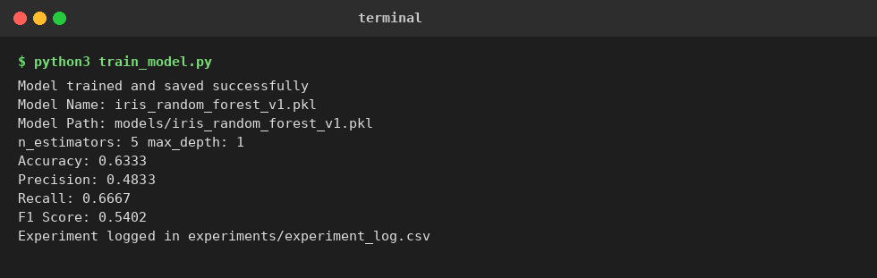
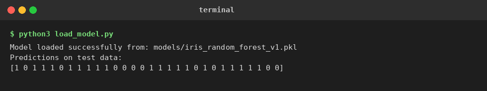
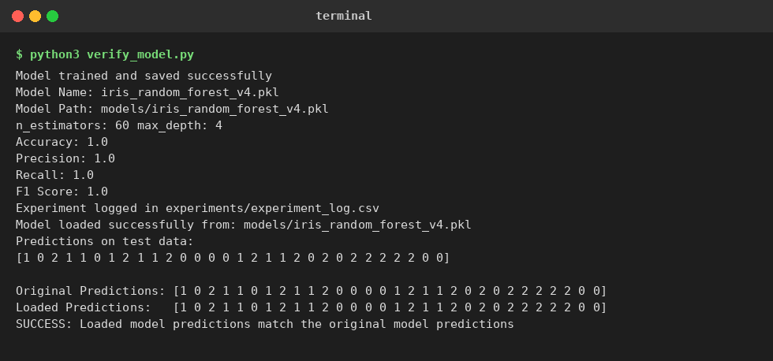
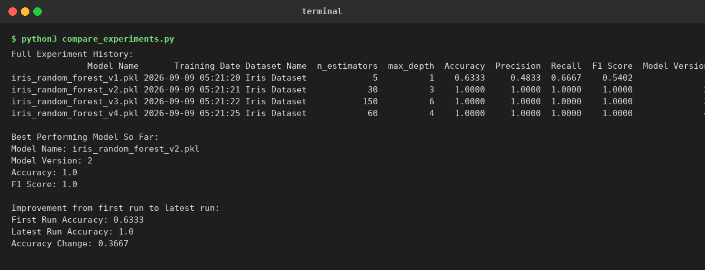

# Day 27 Task: Model Saving & Experiment Tracking

## Objective
This project shows how a trained Machine Learning model can be saved, reloaded,
and reused for predictions. It also keeps a record of every training run so
model performance and configuration can be compared over time.

## Dataset and Model
- Dataset: Iris dataset (from scikit-learn)
- Model: RandomForestClassifier (from scikit-learn)
- Serialization: joblib

## Project Structure
```
day27_project/
│
├── models/                      saved trained models (.pkl files)
│   ├── iris_random_forest_v1.pkl
│   ├── iris_random_forest_v2.pkl
│   ├── iris_random_forest_v3.pkl
│   └── iris_random_forest_v4.pkl
│
├── experiments/
│   └── experiment_log.csv       log of every training experiment
│
├── screenshots/                 screenshots of the scripts running
│   ├── 01_train_model_v1.png
│   ├── 02_load_model.png
│   ├── 03_verify_model.png
│   └── 04_compare_experiments.png
│
├── train_model.py                trains a model, saves it, logs the experiment
├── load_model.py                 loads a saved model and makes predictions
├── verify_model.py               checks loaded model predictions match the original
├── compare_experiments.py        reads the log and compares past experiments
├── main.py                       runs the full pipeline in one go
└── README.md
```

## How It Works

### 1. Model Saving (`train_model.py`)
- Loads the Iris dataset and splits it into train and test sets.
- Trains a `RandomForestClassifier` with given parameters.
- Saves the model to the `models/` folder with a version number in the file name,
  for example `iris_random_forest_v1.pkl`.
- Logs the training run into `experiments/experiment_log.csv`.

Run it with:
```
python3 train_model.py
```

### 2. Model Loading (`load_model.py`)
- Loads a saved `.pkl` model with `joblib.load()`.
- Uses the loaded model to make predictions on the test set.

Run it with:
```
python3 load_model.py
```

### 3. Verifying Saved and Loaded Models Match (`verify_model.py`)
- Trains a new model and stores its predictions.
- Loads that same saved model back from disk.
- Compares both sets of predictions using `numpy.array_equal`.
- Prints a success message if they match exactly.

Run it with:
```
python3 verify_model.py
```

### 4. Experiment Tracking
Every time `train_and_save()` runs, it appends a row to
`experiments/experiment_log.csv` with:
- Model Name
- Training Date
- Dataset Name
- Model Parameters (`n_estimators`, `max_depth`)
- Evaluation Metrics (Accuracy, Precision, Recall, F1 Score)
- Model Version

### 5. Comparing Experiment History (`compare_experiments.py`)
- Reads `experiment_log.csv` using pandas.
- Prints the full experiment history.
- Finds and prints the best performing model so far.
- Compares the accuracy of the first run against the latest run to show
  improvement over time.

Run it with:
```
python3 compare_experiments.py
```

### Run Everything Together
```
python3 main.py
```
This trains three models with different parameters, loads one back for
predictions, and prints a full comparison of all experiments.

## Results

| Model Name | n_estimators | max_depth | Accuracy | Precision | Recall | F1 Score |
|---|---|---|---|---|---|---|
| iris_random_forest_v1.pkl | 5 | 1 | 0.6333 | 0.4833 | 0.6667 | 0.5402 |
| iris_random_forest_v2.pkl | 30 | 3 | 1.0000 | 1.0000 | 1.0000 | 1.0000 |
| iris_random_forest_v3.pkl | 150 | 6 | 1.0000 | 1.0000 | 1.0000 | 1.0000 |
| iris_random_forest_v4.pkl | 60 | 4 | 1.0000 | 1.0000 | 1.0000 | 1.0000 |

The first model was intentionally small (only 5 trees, max depth 1) and
underfits the data, giving lower accuracy. Increasing `n_estimators` and
`max_depth` in later versions raised accuracy to 1.0, showing clear model
improvement across the experiment history.

Loaded model predictions were verified to exactly match the original model's
predictions, confirming the save/load process does not change model behaviour.

## Screenshots

**Training and saving a model (version 1):**



**Loading a saved model and predicting:**



**Verifying saved and loaded model predictions match:**



**Comparing experiment history:**



## Tools Used
- scikit-learn
- joblib
- pandas
- Python csv module

## Learning Resources
- Joblib Documentation: https://joblib.readthedocs.io/
- Python Pickle: https://docs.python.org/3/library/pickle.html
- Scikit-Learn Model Persistence: https://scikit-learn.org/stable/model_persistence.html
- Python CSV Module: https://docs.python.org/3/library/csv.html
